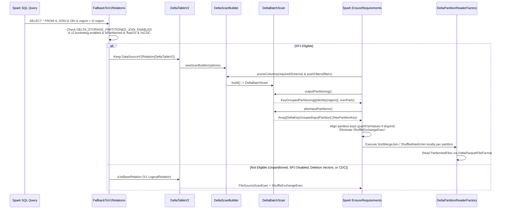

# Delta Lake Storage-Partitioned Join (SPJ) — Design, Implementation & Testing Guide

**Branch:** `spj` (`git@github.com:warrenzhu25/delta.git`)
**Spark Target:** Apache Spark 4.0 / 4.2 (`SPARK-37375` DataSource V2 Storage-Partitioned Joins)

---

## Table of Contents

1. [Executive Summary](#1-executive-summary)
2. [Background: How Spark Storage-Partitioned Join Works](#2-background-how-spark-storage-partitioned-join-works)
3. [Why Delta Lake Previously Could Not Use SPJ](#3-why-delta-lake-previously-could-not-use-spj)
4. [End-to-End Architecture & Query Execution Flow](#4-end-to-end-architecture--query-execution-flow)
5. [Detailed Walkthrough of Code Changes](#5-detailed-walkthrough-of-code-changes)
   - [5.1 Configuration (`DeltaSQLConf.scala`)](#51-configuration-deltasqlconfscala)
   - [5.2 Conditional V2 Retention & Safety Guards (`FallbackToV1Relations.scala`)](#52-conditional-v2-retention--safety-guards-fallbacktov1relationsscala)
   - [5.3 Enabling `SupportsRead` on `DeltaTableV2` (`DeltaTableV2.scala`)](#53-enabling-supportsread-on-deltatablev2-deltatablev2scala)
   - [5.4 V2 Scan Builder, Partitioning & Parquet Reader (`DeltaScanBuilder.scala`)](#54-v2-scan-builder-partitioning--parquet-reader-deltascanbuilderscala)
6. [Key Design Details, Subtle Invariants & Edge Cases](#6-key-design-details-subtle-invariants--edge-cases)
   - [6.1 Subset Partition Keys & Column Pruning (`projectedPartitionFields`)](#61-subset-partition-keys--column-pruning-projectedpartitionfields)
   - [6.2 `PartitionedFile` Schema Invariant vs. `HasPartitionKey` Schema Invariant](#62-partitionedfile-schema-invariant-vs-haspartitionkey-schema-invariant)
   - [6.3 Delta Column Mapping (`name` and `id` modes)](#63-delta-column-mapping-name-and-id-modes)
   - [6.4 Deletion Vector & CDC Safety Fallbacks](#64-deletion-vector--cdc-safety-fallbacks)
   - [6.5 Deterministic Resource Cleanup for Multi-File Partitions](#65-deterministic-resource-cleanup-for-multi-file-partitions)
7. [Comprehensive Test Suite (`DeltaStoragePartitionedJoinSuite.scala`)](#7-comprehensive-test-suite-deltastoragepartitionedjoinsuitescala)
8. [How to Run & Configure SPJ](#8-how-to-run--configure-spj)

---

## 1. Executive Summary

When joining two large tables in Apache Spark (e.g., `SELECT * FROM orders o JOIN line_items l ON o.region = l.region`), Spark's physical planner (`EnsureRequirements`) normally inserts a `ShuffleExchangeExec` on both sides of the join (`HashPartitioning(region, numPartitions)`), redistributing all data across the network before performing a `SortMergeJoinExec` or `ShuffledHashJoinExec`.

However, if both Delta tables are already physically partitioned on disk by `region` (`PARTITIONED BY (region)`), every row with `region = 'US'` is already stored exclusively in files belonging to the `region = 'US'` partition directory/metadata entry. Shuffling the data across the network is completely redundant.

**Storage-Partitioned Join (SPJ, `SPARK-37375`)** allows a DataSource V2 (`DSv2`) table scan to report its physical storage layout (`KeyGroupedPartitioning`) and tag each `InputPartition` with its partition key value (`HasPartitionKey`). Spark's `EnsureRequirements` rule aligns the partition buckets from both scans (`BatchScanExec`) and executes the join locally within each task—achieving **zero network shuffles (`ShuffleExchangeExec` = 0)** not only for joins (`INNER`, `LEFT/RIGHT/FULL OUTER`, `LEFT SEMI/ANTI`), but also for downstream `GROUP BY` aggregations on the partition keys.

---

## 2. Background: How Spark Storage-Partitioned Join Works

Spark's `EnsureRequirements` catalyst physical plan rule checks whether the child physical operators of a binary join or unary aggregation satisfy the required `ClusteredDistribution(clusteringKeys)`.

For a scan to satisfy `ClusteredDistribution` via SPJ, four strict contracts in the Spark DataSource V2 Connector API must be met:

1. **Physical Operator Must Be `BatchScanExec` (DSv2):**
   Spark's V1 `FileSourceScanExec` only supports Hive-style fixed-modulus `HashPartitioning` bucketing (`BucketSpec`). It does **not** participate in `KeyGroupedPartitioning` or `KeyGroupedShuffleSpec`.
2. **Scan Must Implement `SupportsReportPartitioning`:**
   `Scan.outputPartitioning()` must return an instance of `org.apache.spark.sql.connector.read.partitioning.KeyGroupedPartitioning(expressions: Array[Expression], numPartitions: Int)`, where `expressions` are V2 connector expressions (e.g., `Expressions.identity("region")`) referencing columns present in the scan's `readSchema()`.
3. **`InputPartition` Must Implement `HasPartitionKey`:**
   Every `InputPartition` returned by `Batch.planInputPartitions()` must implement `HasPartitionKey` and return a Catalyst `InternalRow` from `partitionKey()` whose field types and count match the `expressions` in `KeyGroupedPartitioning`.
4. **One `InputPartition` per Distinct Partition Key:**
   All data files (`AddFile`s) sharing the exact same partition key value must be grouped into a single `InputPartition`, and the resulting array of `InputPartition`s must be deterministically ordered by `RowOrdering.createNaturalAscendingOrdering(partitionDataTypes)`.

When two `BatchScanExec` nodes have mismatched or disjoint sets of partition values (for example, `table1` has partitions `(10, 20)` and `table2` has `(20, 30)`), Spark's `spark.sql.sources.v2.bucketing.pushPartValues.enabled=true` feature merges the union of partition keys `(10, 20, 30)` and injects empty placeholder partitions on the side missing a given key, preserving a shuffle-free join even for `LEFT`, `RIGHT`, and `FULL OUTER` joins.

---

## 3. Why Delta Lake Previously Could Not Use SPJ

Prior to this implementation, Delta Lake could not use SPJ for three architectural reasons:

1. **`DeltaTableV2` Lacked `SupportsRead`:**
   `DeltaTableV2` implemented Spark's `Table`, `SupportsWrite`, and `TranslatableTable` interfaces, but did not implement `SupportsRead` (`newScanBuilder`) or advertise `TableCapability.BATCH_READ`.
2. **Unconditional Fallback to V1 (`FallbackToV1Relations`):**
   During logical plan analysis (`DeltaAnalysis`), the `FallbackToV1Relations` rule matched every `DataSourceV2Relation(d: DeltaTableV2, ...)` and rewrote it to `DeltaTableV2.toBaseRelation`—a V1 `LogicalRelation(HadoopFsRelation)` backed by `TahoeLogFileIndex`. This always produced a V1 `FileSourceScanExec` in physical planning.
3. **No `KeyGroupedPartitioning` / `HasPartitionKey` Implementation:**
   Delta had no V2 `ScanBuilder`, `Batch`, or `InputPartition` implementation that converted `AddFile.partitionValues` (`Map[String, String]`) into typed Catalyst `InternalRow` keys grouped by partition value.

---

## 4. End-to-End Architecture & Query Execution Flow



---

## 5. Detailed Walkthrough of Code Changes

### 5.1 Configuration (`DeltaSQLConf.scala`)
- **File:** [`spark/src/main/scala/org/apache/spark/sql/delta/sources/DeltaSQLConf.scala`](file:///usr/local/google/home/warrenzhu/delta/spark/src/main/scala/org/apache/spark/sql/delta/sources/DeltaSQLConf.scala#L492-L500)
- **Symbol:** `DeltaSQLConf.DELTA_STORAGE_PARTITIONED_JOIN_ENABLED`
- **Key:** `spark.databricks.delta.storagePartitionedJoin.enabled` (Boolean, default `false`)
- **Rationale:** Keeping the flag disabled by default guarantees zero regressions for existing Delta workloads that rely on V1 `FileSourceScanExec` plan shapes or custom V1 rules, while allowing users to opt in dynamically per session or cluster.

### 5.2 Conditional V2 Retention & Safety Guards (`FallbackToV1Relations.scala`)
- **File:** [`spark/src/main/scala/org/apache/spark/sql/delta/FallbackToV1Relations.scala`](file:///usr/local/google/home/warrenzhu/delta/spark/src/main/scala/org/apache/spark/sql/delta/FallbackToV1Relations.scala#L30-L59)
- **Logic:**
  ```scala
  case d @ DataSourceV2Relation(v2Table: DeltaTableV2, _, _, _, _) =>
    val spjEnabled = conf.getConf(DeltaSQLConf.DELTA_STORAGE_PARTITIONED_JOIN_ENABLED) &&
      conf.getConf(SQLConf.V2_BUCKETING_ENABLED)
    val snapshot = v2Table.initialSnapshot
    val isPartitioned = snapshot.metadata.partitionColumns.nonEmpty
    val hasDeletionVectors = DeletionVectorUtils.deletionVectorsReadable(snapshot)
    val isCdcRead = CDCReader.isCDCRead(d.options)
    if (spjEnabled && isPartitioned && !hasDeletionVectors && !isCdcRead) {
      d
    } else {
      DeltaTableV2.withEnrichedOptions(d.table, d.options, d.catalog).toBaseRelation
    }
  ```
- **Why this placement is critical:** `FallbackToV1Relations` runs at the end of `DeltaAnalysis`. By selectively preserving `DataSourceV2Relation(DeltaTableV2)` only when SPJ is enabled and safe, all upstream Delta analysis rules (time travel, schema validation, column mapping resolution) continue to work unchanged.

### 5.3 Enabling `SupportsRead` on `DeltaTableV2` (`DeltaTableV2.scala`)
- **File:** [`spark/src/main/scala/org/apache/spark/sql/delta/catalog/DeltaTableV2.scala`](file:///usr/local/google/home/warrenzhu/delta/spark/src/main/scala/org/apache/spark/sql/delta/catalog/DeltaTableV2.scala#L69-L300)
- **Changes:**
  1. Added `SupportsRead` to the class inheritance list of `DeltaTableV2`.
  2. Updated `capabilities()` to return `Set(ACCEPT_ANY_SCHEMA, BATCH_READ, V1_BATCH_WRITE, OVERWRITE_BY_FILTER, TRUNCATE).asJava`.
  3. Implemented `newScanBuilder(options: CaseInsensitiveStringMap): ScanBuilder` to construct `new DeltaScanBuilder(spark, deltaLog, initialSnapshot, tableSchema, options)`.

### 5.4 V2 Scan Builder, Partitioning & Parquet Reader (`DeltaScanBuilder.scala`)
- **File:** [`spark/src/main/scala/org/apache/spark/sql/delta/v2/DeltaScanBuilder.scala`](file:///usr/local/google/home/warrenzhu/delta/spark/src/main/scala/org/apache/spark/sql/delta/v2/DeltaScanBuilder.scala)

#### Component Breakdown:
1. **`DeltaScanBuilder`:**
   - Implements `SupportsPushDownRequiredColumns`: records the pruned `requiredSchema` pushed down by Spark's `V2ScanRelationPushDown` optimizer rule.
   - Implements `SupportsPushDownFilters`: translates `org.apache.spark.sql.sources.Filter` predicates into Catalyst `Expression`s via `DataSourceStrategy.translateFilter`, then splits them into **metadata (partition) predicates** and **data predicates** using `DeltaTableUtils.splitMetadataAndDataPredicates`.
   - Returns all pushed filters in `pushedFilters()` while also reporting data filters for post-scan evaluation so filter correctness is preserved under all Parquet reader configurations.

2. **`DeltaBatchScan`:**
   - Calls `snapshot.filesForScan(partitionFilters)` to prune `AddFile` entries at the Delta log level using the pushed partition predicates.
   - Computes `projectedPartitionFields` (the subset of `metadata.partitionSchema` present in `readSchema`) and `fullPartitionFields` (`metadata.partitionSchema.fields`).
   - Extracts each `AddFile`'s partition column string values from `addFile.partitionValues` using `DeltaColumnMapping.getPhysicalName(field)`, and converts them to Catalyst internal values (`UTF8String`, `Integer`, `Long`, `Date` days-since-epoch, or `null`) via `CatalystTypeConverters.createToCatalystConverter(field.dataType)`.
   - Groups all `DeltaScanFileInfo` objects that share the same `projectedKeyRow` using `InternalRowComparableWrapper`, sorts the keys in ascending natural order via `RowOrdering.createNaturalAscendingOrdering`, and wraps each group in a `DeltaKeyGroupedInputPartition`.
   - Reports `KeyGroupedPartitioning(projectedPartitionFields.map(f => Expressions.identity(f.name)), groupedPartitions.length)`.

3. **`DeltaKeyGroupedInputPartition` & `DeltaScanFileInfo`:**
   - `DeltaKeyGroupedInputPartition(files: Seq[DeltaScanFileInfo], partitionKeyRow: InternalRow)` implements `InputPartition` and `HasPartitionKey`.
   - `DeltaScanFileInfo` stores the absolute file URI path, byte length, modification timestamp, and the **full** `partitionValues: InternalRow` required by `ParquetFileFormat`.

4. **`DeltaPartitionReaderFactory` & `DeltaBatchPartitionReader`:**
   - Builds a reader function via `new DeltaParquetFileFormat( snapshot.protocol, snapshot.metadata, nullableRowTrackingConstantFields = false, optimizationsEnabled = false ).buildReaderWithPartitionValues(...)`.
   - Uses `deltaLog.newDeltaHadoopConf()` so cloud storage credentials and Delta-specific Hadoop configs are honored on executors.
   - Supports both vectorized columnar reads (`supportColumnarReads` / `createColumnarReader`) and row-based reads (`createReader`).

---

## 6. Key Design Details, Subtle Invariants & Edge Cases

### 6.1 Subset Partition Keys & Column Pruning (`projectedPartitionFields`)
Consider a table partitioned by `(region, state)` and a query that joins only on `region` without selecting `state`:
```sql
SELECT t1.region, t1.amount, t2.tax
FROM sales t1 JOIN rates t2 ON t1.region = t2.region
```
When `spark.sql.sources.v2.bucketing.allowJoinKeysSubsetOfPartitionKeys.enabled = true`, Spark's column pruning rule (`V2ScanRelationPushDown`) removes `state` from `readSchema` (`readSchema = [region, amount]`).
- If `DeltaBatchScan.outputPartitioning()` blindly reported all table partition columns `[identity(region), identity(state)]`, Spark's `V2ExpressionUtils.toCatalystOpt` would try to resolve `state` against the scan's output attributes (`[region, amount]`), fail to resolve `state`, and **silently disable SPJ**.
- **Solution:** Modeled after Apache Iceberg's `Partitioning.groupingKeyType`, `DeltaBatchScan` intersects `metadata.partitionSchema` with `readSchema`:
  ```scala
  private val projectedPartitionFields: Seq[StructField] = {
    val readFieldNames = readSchema.fieldNames.toSet
    fullPartitionFields.filter(f => readFieldNames.contains(f.name))
  }
  ```
  Both `outputPartitioning()` and `DeltaKeyGroupedInputPartition.partitionKey()` use `projectedPartitionFields`, allowing files with `(region='US', state='CA')` and `(region='US', state='NY')` to be coalesced into a single `InputPartition(partitionKey = ['US'])` when `state` is not in `readSchema`!

### 6.2 `PartitionedFile` Schema Invariant vs. `HasPartitionKey` Schema Invariant
A subtle interaction exists between Spark's DSv2 `BatchScanExec` and Spark's `ParquetFileFormat`:
- **Invariant 1 (`BatchScanExec`):** `HasPartitionKey.partitionKey().numFields` **must equal** the number of expressions in `KeyGroupedPartitioning` (`projectedPartitionFields.size`).
- **Invariant 2 (`ParquetFileFormat`):** `ParquetFileFormat.buildReaderWithPartitionValues` takes `partitionSchema = metadata.partitionSchema` and `dataSchema = readDataSchema`, and explicitly asserts at runtime:
  ```scala
  assert(file.partitionValues.numFields == partitionSchema.size)
  ```
- **How we satisfy both:** Each `DeltaKeyGroupedInputPartition` stores `partitionKeyRow` of length `projectedPartitionFields.size` (satisfying `BatchScanExec`), while each `DeltaScanFileInfo` inside that partition stores `fullPartitionRow` of length `metadata.partitionSchema.size` (satisfying `ParquetFileFormat`).

### 6.3 Delta Column Mapping (`name` and `id` modes)
When Delta Column Mapping (`delta.columnMapping.mode = 'name'` or `'id'`) is enabled on a table:
- `metadata.partitionSchema` uses **logical** column names (e.g., `part_key`), which match the SQL query and `readSchema`.
- However, `AddFile.partitionValues` in the Delta transaction log is keyed by the column's **physical** name (e.g., `col-a8f3...`).
- Using `DeltaColumnMapping.getPhysicalName(field)` when looking up `addFile.partitionValues.get(physName)` ensures partition values are accurately extracted instead of silently resolving to `null`.

### 6.4 Deletion Vector & CDC Safety Fallbacks
When Deletion Vectors (`delta.enableDeletionVectors = true`) are active on a table and rows are deleted, `AddFile` entries point to Parquet files containing both live and deleted rows, accompanied by a Deletion Vector bitmap. Because `DeltaParquetFileFormat` requires additional DV bitmap columns (`__delta_internal_is_row_deleted`) that V1 `TahoeFileIndex` injects, `FallbackToV1Relations` checks `DeletionVectorUtils.deletionVectorsReadable(snapshot)` and automatically routes DV-enabled tables back to V1 `FileSourceScanExec`, guaranteeing deleted rows are never exposed.

### 6.5 Deterministic Resource Cleanup for Multi-File Partitions
A single Delta partition (e.g., `region = 'US'`) commonly contains multiple Parquet `AddFile`s written across separate commits. `DeltaKeyGroupedInputPartition` groups all of those `AddFile`s into one task. `DeltaBatchPartitionReader` iterates sequentially through each file's `Iterator[T]` and explicitly invokes `closeCurrentIterator()` (calling `AutoCloseable.close()` on the underlying Parquet record reader) both when transitioning from one file to the next and when `DeltaBatchPartitionReader.close()` is invoked by Spark's task completion listener.

---

## 7. Comprehensive Test Suite (`DeltaStoragePartitionedJoinSuite.scala`)

The test suite in [`spark/src/test/scala/org/apache/spark/sql/delta/DeltaStoragePartitionedJoinSuite.scala`](file:///usr/local/google/home/warrenzhu/delta/spark/src/test/scala/org/apache/spark/sql/delta/DeltaStoragePartitionedJoinSuite.scala) is modeled after Apache Iceberg's `TestStoragePartitionedJoins` and validates 18 unit and end-to-end scenarios using `AdaptiveSparkPlanHelper` to inspect physical plans after AQE execution:

| # | Test Name | Scenario & Physical Plan Verification |
| :- | :--- | :--- |
| **1** | `Delta Storage-Partitioned Join eliminates shuffle exchange on single partition key` | Joins two string-partitioned Delta tables (`dept`). Asserts `ShuffleExchangeExec == 0` and `BatchScanExec == 2`. |
| **2** | `SPJ with multiple partition keys (composite partition)` | Joins two tables partitioned by `(region: String, dept: Int)` on both columns. Asserts `ShuffleExchangeExec == 0`. |
| **3** | `SPJ with mismatched/disjoint partition values (pushPartValues)` | Table 1 has partitions `(10, 20)`, Table 2 has `(20, 30)`. Verifies `pushPartValues` aligns partition keys without any shuffle. |
| **4** | `SPJ with multiple files per partition` | Appends multiple commits to the same partition keys so each partition holds multiple `AddFile`s. Verifies `DeltaBatchPartitionReader` chains all files and produces exact join counts with 0 shuffles. |
| **5** | `SPJ with typed partition columns: Date and Integer` | Joins tables partitioned by `(dt: Date, category: Int)`. Verifies `CatalystTypeConverters` converts date strings (`2025-01-01`) to Catalyst epoch days and orders keys properly. |
| **6** | `Incompatible partition columns fall back to shuffle` | Joins `t1.part_col = t2.non_part_col`. Verifies Spark safely inserts a `ShuffleExchangeExec` (`> 0`) and returns accurate results. |
| **7** | `One side unpartitioned falls back to shuffle` | Joins a partitioned Delta table with an unpartitioned Delta table. Verifies the unpartitioned table uses V1 `FileSourceScanExec` and shuffles cleanly. |
| **8** | `Empty partitioned table in SPJ falls back to shuffle without error` | Joins an empty partitioned Delta table with a populated partitioned Delta table. Verifies empty `KeyGroupedPartitioning` does not throw and returns 0 rows. |
| **9** | `Fallback to V1 reader when SPJ is disabled` | Sets `spark.databricks.delta.storagePartitionedJoin.enabled = false`. Verifies `BatchScanExec == 0` and `FileSourceScanExec == 2`. |
| **10** | `E2E SPJ: Three-way partitioned join without shuffle exchanges` | Executes a 3-table join (`customers ⋈ orders ⋈ shipments`) all partitioned by `region`. Verifies `BatchScanExec == 3` and `ShuffleExchangeExec == 0` across the entire multi-way join tree. |
| **11** | `E2E SPJ: Aggregation with group by partition key avoids shuffle exchange` | Joins two partitioned tables on `dept` and runs `GROUP BY t1.dept` (`SUM(salary + bonus)`). Verifies **both** the join and the aggregation execute with `ShuffleExchangeExec == 0`. |
| **12** | `E2E SPJ: Subquery / Semi-Join on partition key avoids shuffle exchange` | Runs `SELECT ... FROM orders WHERE region IN (SELECT region FROM active_regions WHERE active = true)`. Verifies `LEFT SEMI` join executes with `ShuffleExchangeExec == 0`. |
| **13** | `E2E SPJ: Left, Right, and Full Outer Joins without shuffle exchanges` | Runs `LEFT OUTER`, `RIGHT OUTER`, and `FULL OUTER` joins across tables with disjoint partition keys `(10, 20)` and `(20, 30)`. Verifies `pushPartValues` synthesizes empty sibling partitions so unmatched outer rows (`NULL`-padded) are emitted with `ShuffleExchangeExec == 0`. |
| **14** | `E2E SPJ: Join keys subset of partition keys (allowJoinKeysSubsetOfPartitionKeys)` | Both tables are partitioned by `(region, state)` with `allowJoinKeysSubsetOfPartitionKeys.enabled = true`, joined only on `t1.region = t2.region`. Verifies `projectedPartitionFields` enables SPJ with `ShuffleExchangeExec == 0`. |
| **15** | `SPJ with WHERE partition filter pushdown prunes non-matching partitions` | Runs a join with `WHERE t1.p = 1 AND t2.p = 1` on tables having partitions `1, 2, 3`. Asserts `ShuffleExchangeExec == 0` and verifies `BatchScanExec.inputPartitions.length == 1` on both scans (confirming partition pruning at the Delta log level). |
| **16** | `Deletion Vector enabled table safely falls back to V1 and filters deleted rows` | Enables `delta.enableDeletionVectors = true`, deletes a row to generate a DV, and joins with another table. Verifies `FallbackToV1Relations` falls back to V1 and the deleted row is excluded from output. |
| **17** | `SPJ with Delta Column Mapping (name mode)` | Creates two partitioned tables with `delta.columnMapping.mode = 'name'`. Verifies `DeltaColumnMapping.getPhysicalName` resolves physical partition keys in `AddFile.partitionValues` and executes SPJ with `ShuffleExchangeExec == 0`. |
| **18** | `SPJ with tables containing NULL partition values` | Inserts rows with `dept = NULL` alongside non-null partitions (`10, 20`). Verifies `CatalystTypeConverters` and `InternalRowComparableWrapper` group `NULL` partition keys without `NullPointerException` and execute with `ShuffleExchangeExec == 0`. |

---

## 8. How to Run & Configure SPJ

### Spark SQL Configuration
To enable Delta Storage-Partitioned Joins in a Spark session:
```scala
spark.conf.set("spark.databricks.delta.storagePartitionedJoin.enabled", "true")
spark.conf.set("spark.sql.sources.v2.bucketing.enabled", "true")
spark.conf.set("spark.sql.sources.v2.bucketing.pushPartValues.enabled", "true")
// Optional: allow SPJ when joining on a subset of table partition columns
spark.conf.set("spark.sql.sources.v2.bucketing.allowJoinKeysSubsetOfPartitionKeys.enabled", "true")
```

### Running the Test Suite via SBT
```bash
build/sbt "spark/testOnly org.apache.spark.sql.delta.DeltaStoragePartitionedJoinSuite"
```
