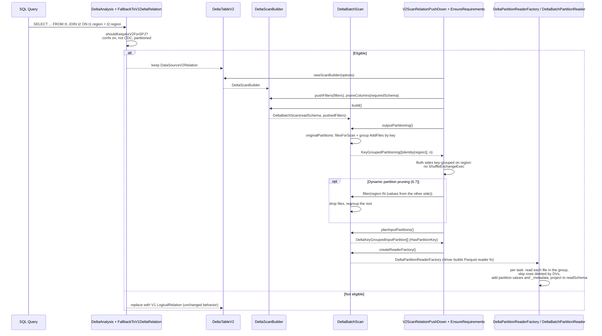
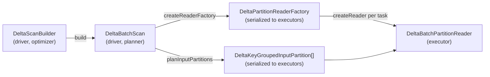

# Delta Lake Storage-Partitioned Join (SPJ): Design & Code Walkthrough

**Spark target:** Apache Spark 4.x DataSource V2 Storage-Partitioned Join
([SPARK-37375](https://issues.apache.org/jira/browse/SPARK-37375))
**Status:** Opt-in, disabled by default (`spark.databricks.delta.storagePartitionedJoin.enabled`)

This document explains the feature and walks through **every code change** file by file, so you
can understand the change without reading the diff side by side.

---

## Table of Contents

1. [Summary](#1-summary)
2. [Background: How Spark SPJ Works](#2-background-how-spark-spj-works)
3. [Why Delta Could Not Use SPJ Before](#3-why-delta-could-not-use-spj-before)
4. [Changed Files at a Glance](#4-changed-files-at-a-glance)
5. [End-to-End Flow of One Query](#5-end-to-end-flow-of-one-query)
6. [Code Walkthrough](#6-code-walkthrough)
   - [6.1 `DeltaSQLConf.scala`: the feature flag](#61-deltasqlconfscala-the-feature-flag)
   - [6.2 `FallbackToV1Relations.scala`: when to keep the V2 relation](#62-fallbacktov1relationsscala-when-to-keep-the-v2-relation)
   - [6.3 `DeltaTableV2.scala`: `SupportsRead`](#63-deltatablev2scala-supportsread)
   - [6.4 `v2/DeltaScanBuilder.scala`: the V2 scan](#64-v2deltascanbuilderscala-the-v2-scan)
   - [6.5 Deletion Vector support](#65-deletion-vector-support)
   - [6.6 `_metadata` column support](#66-_metadata-column-support)
   - [6.7 Dynamic partition pruning](#67-dynamic-partition-pruning)
7. [Design Details & Invariants](#7-design-details--invariants)
8. [Behavior Matrix](#8-behavior-matrix)
9. [Limitations](#9-limitations)
10. [Test Suite](#10-test-suite)
11. [How to Enable & Test](#11-how-to-enable--test)
12. [Review Notes](#12-review-notes)

---

## 1. Summary

Take a join such as `SELECT * FROM orders o JOIN line_items l ON o.region = l.region`. Normally
Spark's `EnsureRequirements` rule adds a `ShuffleExchangeExec` on both sides, which sends all rows
across the network grouped by `region` before the join runs.

Now suppose both tables are Delta tables `PARTITIONED BY (region)`. Every row with
`region = 'US'` already lives only in files of the `US` partition, so the shuffle is wasted work.

**Storage-Partitioned Join (SPJ)** lets a DataSource V2 scan:

1. tell Spark how its data is laid out (`KeyGroupedPartitioning`), and
2. tag every input split with its partition key (`HasPartitionKey`).

Spark then pairs up splits with the same key from both sides and joins them in the same task,
with no shuffle. This works for inner, left, right, full outer, semi and anti joins. It also
removes the shuffle for aggregations grouped by the partition columns.

This change adds an **opt-in** DataSource V2 read path for partitioned Delta tables that supports
SPJ. Tables with **Deletion Vectors** are supported: the V2 reader filters deleted rows the same
way the V1 reader does (6.5). The **`_metadata` column** (file metadata, `row_index`, and the row
tracking fields `row_id` / `row_commit_version`) is supported too, with the same values as V1
(6.6). **Dynamic partition pruning** prunes the V2 scan at runtime, both in broadcast joins and in
shuffle-free SPJ joins (6.7).

---

## 2. Background: How Spark SPJ Works

Spark's `EnsureRequirements` checks whether each child of a join or aggregation already satisfies
the required `ClusteredDistribution(keys)`. Through SPJ, a scan satisfies it when:

| # | Requirement | What Delta provides |
| :- | :--- | :--- |
| 1 | The physical scan is a `BatchScanExec` (DSv2). V1 `FileSourceScanExec` only knows Hive bucketing. | The relation is kept as `DataSourceV2Relation` (6.2) and `DeltaTableV2` implements `SupportsRead` (6.3). |
| 2 | The `Scan` implements `SupportsReportPartitioning` and returns `KeyGroupedPartitioning(exprs, n)`, where `exprs` refer to columns in `readSchema()`. | `DeltaBatchScan.outputPartitioning()` returns `identity(col)` for each partition column in `readSchema`. |
| 3 | Every `InputPartition` implements `HasPartitionKey`, and `partitionKey()` matches `exprs` in number and type. | `DeltaKeyGroupedInputPartition.partitionKey()` |

Spark settings that matter:

| Setting | Effect |
| :--- | :--- |
| `spark.sql.sources.v2.bucketing.enabled` | Master switch for SPJ in Spark. **Required.** |
| `spark.sql.sources.v2.bucketing.pushPartValues.enabled` | When the two sides have different sets of keys (e.g. `{p1,p2}` vs `{p2,p3}`), Spark adds empty splits on the side that is missing a key so the join stays shuffle-free. |
| `spark.sql.sources.v2.bucketing.allowJoinKeysSubsetOfPartitionKeys.enabled` | Allows SPJ when the join keys are a subset of the partition columns. |
| `spark.sql.requireAllClusterKeysForCoPartition` | Must be `false` when the join keys are a strict superset of the reported partition columns. |

`BatchScanExec` itself groups the input partitions by key and sorts them, so a connector does not
have to sort its partitions.

---

## 3. Why Delta Could Not Use SPJ Before

1. **`DeltaTableV2` had no `SupportsRead`**, so there was no `newScanBuilder` and no V2 scan.
2. **Every read fell back to V1.** During analysis, `DeltaAnalysis` matches every
   `DataSourceV2Relation(DeltaTableV2)` with the `FallbackToV1DeltaRelation` extractor and
   replaces it with a V1 `LogicalRelation(HadoopFsRelation(TahoeLogFileIndex))`. That always
   becomes a `FileSourceScanExec` in the physical plan.
3. **Nothing turned `AddFile.partitionValues` (a `Map[String, String]`) into typed partition
   keys** grouped into `InputPartition`s.

---

## 4. Changed Files at a Glance

| File | Change | Lines |
| :--- | :--- | :--- |
| `spark/src/main/scala/org/apache/spark/sql/delta/sources/DeltaSQLConf.scala` | New confs `storagePartitionedJoin.enabled` and (internal) `storagePartitionedJoin.deletionVectors.enabled` | +17 |
| `spark/src/main/scala/org/apache/spark/sql/delta/FallbackToV1Relations.scala` | Keep V2 relation when the table qualifies; table-level check shared with `DeltaTableV2.metadataColumns` | +43 / -2 |
| `spark/src/main/scala/org/apache/spark/sql/delta/catalog/DeltaTableV2.scala` | `with SupportsRead`, `newScanBuilder`; `with SupportsMetadataColumns`, `metadataColumns` (6.6.1) | +30 / -2 |
| `spark/src/main/scala/org/apache/spark/sql/delta/DeltaAnalysis.scala` | V2 → V1 conversion keeps `_metadata` references valid (6.6.5) | +93 / -7 |
| `spark/src/main/scala/org/apache/spark/sql/delta/files/TahoeFileIndex.scala` | Per-file constant metadata (row tracking, DV descriptor) moved into a reusable `TahoeFileIndex.constantMetadataForFile` | +30 / -17 |
| `spark/src/main/scala/org/apache/spark/sql/delta/v2/DeltaScanBuilder.scala` | **New.** Scan builder, scan (with statistics and runtime filtering), input partition, reader factory (with `_metadata`), reader (with DV filtering) | ~745 |
| `spark/src/test/scala/org/apache/spark/sql/delta/DeltaStoragePartitionedJoinSuite.scala` | **New.** 53 tests | ~1130 |

No other code paths change when the conf is `false`. The only extra work is two conf lookups per
Delta relation during analysis (plus two more when Spark asks a Delta table for its metadata
columns). DELETE and UPDATE now convert their target with
`DeltaRelation.toV1WithMetadataReferences` (6.6.5), which does the same conversion as before and
rewrites nothing unless the V2 relation exposes `_metadata`, which needs the conf.

---

## 5. End-to-End Flow of One Query


```mermaid
sequenceDiagram
    participant User as SQL Query
    participant Analysis as DeltaAnalysis + FallbackToV1DeltaRelation
    participant TableV2 as DeltaTableV2
    participant Builder as DeltaScanBuilder
    participant Scan as DeltaBatchScan
    participant Planner as V2ScanRelationPushDown + EnsureRequirements
    participant Exec as DeltaPartitionReaderFactory / DeltaBatchPartitionReader

    User->>Analysis: SELECT ... FROM t1 JOIN t2 ON t1.region = t2.region
    Analysis->>Analysis: shouldKeepAsV2ForSPJ?<br/>confs on, not CDC, partitioned
    alt Eligible
        Analysis-->>TableV2: keep DataSourceV2Relation
        Planner->>TableV2: newScanBuilder(options)
        TableV2-->>Builder: DeltaScanBuilder
        Planner->>Builder: pushFilters(filters), pruneColumns(requiredSchema)
        Planner->>Builder: build()
        Builder-->>Scan: DeltaBatchScan(readSchema, pushedFilters)
        Planner->>Scan: outputPartitioning()
        Scan->>Scan: originalPartitions: filesForScan + group AddFiles by key
        Scan-->>Planner: KeyGroupedPartitioning([identity(region)], n)
        Planner->>Planner: Both sides key-grouped on region:<br/>no ShuffleExchangeExec
        opt Dynamic partition pruning (6.7)
            Planner->>Scan: filter(region IN (values from the other side))
            Scan->>Scan: drop files, regroup the rest
        end
        Planner->>Scan: planInputPartitions()
        Scan-->>Planner: DeltaKeyGroupedInputPartition[] (HasPartitionKey)
        Planner->>Scan: createReaderFactory()
        Scan-->>Exec: DeltaPartitionReaderFactory (driver builds Parquet reader fn)
        Exec->>Exec: per task: read each file in the group,<br/>skip rows deleted by DVs,<br/>add partition values and _metadata, project to readSchema
    else Not eligible
        Analysis-->>TableV2: replace with V1 LogicalRelation (unchanged behavior)
    end
```

---

## 6. Code Walkthrough

### 6.1 `DeltaSQLConf.scala`: the feature flag

```scala
val DELTA_STORAGE_PARTITIONED_JOIN_ENABLED =
  buildConf("storagePartitionedJoin.enabled")
    .doc("When true, reads of partitioned Delta tables use a DataSource V2 scan that reports " +
      "the table's partitioning to Spark, enabling Storage-Partitioned Join (SPJ) to avoid " +
      "shuffles when join/grouping keys match the table's partition columns. Requires " +
      "spark.sql.sources.v2.bucketing.enabled=true. CDC reads always use the V1 scan.")
    .booleanConf
    .createWithDefault(false)

val DELTA_STORAGE_PARTITIONED_JOIN_DELETION_VECTORS_ENABLED =
  buildConf("storagePartitionedJoin.deletionVectors.enabled")
    .internal()
    .doc("When true, tables with Deletion Vectors can be read by the Storage-Partitioned Join " +
      "V2 scan, which filters deleted rows itself. When false, such tables use the V1 scan.")
    .booleanConf
    .createWithDefault(true)
```

- `buildConf` adds the `spark.databricks.delta.` prefix, so the full key is
  `spark.databricks.delta.storagePartitionedJoin.enabled`.
- It defaults to `false`. With the flag off, the plan is exactly what it is today.
- It is a public (non-`internal()`) conf because users have to set it themselves.
- The doc string lists the prerequisites and the known limitation, so users see them in
  `SET -v` output.
- `storagePartitionedJoin.deletionVectors.enabled` is an internal kill switch for DV support
  (6.5). It defaults to `true`; setting it to `false` sends tables with Deletion Vectors back to
  V1 while other partitioned tables keep using the V2 scan.

### 6.2 `FallbackToV1Relations.scala`: when to keep the V2 relation

**Before:**

```scala
/** Fall back to V1 nodes, since we don't have a V2 reader for Delta right now */
object FallbackToV1DeltaRelation {
  def unapply(dsv2: DataSourceV2Relation): Option[LogicalRelation] = dsv2.table match {
    case d: DeltaTableV2 if dsv2.getTagValue(DeltaRelation.KEEP_AS_V2_RELATION_TAG).isEmpty =>
      Some(DeltaRelation.fromV2Relation(d, dsv2, dsv2.options))
    case _ => None
  }
}
```

**After:**

```scala
object FallbackToV1DeltaRelation {
  def unapply(dsv2: DataSourceV2Relation): Option[LogicalRelation] = dsv2.table match {
    case d: DeltaTableV2 if dsv2.getTagValue(DeltaRelation.KEEP_AS_V2_RELATION_TAG).isEmpty =>
      if (shouldKeepAsV2ForSPJ(d, dsv2)) {
        None                                                    // (1)
      } else {
        Some(DeltaRelation.fromV2Relation(d, dsv2, dsv2.options))  // (2)
      }
    case _ => None
  }

  private def shouldKeepAsV2ForSPJ(d: DeltaTableV2, dsv2: DataSourceV2Relation): Boolean = {
    !CDCReader.isCDCRead(dsv2.options) && isTableEligibleForV2Read(d)                  // (5)
  }

  // Also used by DeltaTableV2.metadataColumns (6.6.1)
  private[delta] def isTableEligibleForV2Read(d: DeltaTableV2): Boolean = {
    val conf = d.spark.sessionState.conf
    val enabled = conf.getConf(DeltaSQLConf.DELTA_STORAGE_PARTITIONED_JOIN_ENABLED) &&  // (3)
      conf.getConf(SQLConf.V2_BUCKETING_ENABLED)                                       // (4)
    enabled && {
      val snapshot = d.initialSnapshot                                                 // (6)
      snapshot.metadata.partitionColumns.nonEmpty &&                                   // (7)
        (conf.getConf(DeltaSQLConf.DELTA_STORAGE_PARTITIONED_JOIN_DELETION_VECTORS_ENABLED) ||
          !DeletionVectorUtils.deletionVectorsReadable(snapshot))                     // (8)
    }
  }
}
```

**How it's used.** `DeltaAnalysis` has the case
`case FallbackToV1DeltaRelation(v1Relation) => v1Relation`. An extractor that returns `None`
doesn't match, so the `DataSourceV2Relation` stays in the plan.

1. **`None` means "don't match".** The relation stays V2, and Spark's `V2ScanRelationPushDown`
   later calls `newScanBuilder`.
2. **The V1 conversion is unchanged.** Same call as before.
3. **Delta feature flag.** Checked first because it is cheap.
4. **Spark's SPJ switch.** If Spark won't use the reported partitioning, the V2 scan has no
   benefit and only adds risk, so the read stays on V1.
5. **CDC reads** (`readChangeFeed=true`) need V1's CDC handling in `DeltaRelation.fromV2Relation`.
   This is the only check that depends on the read options, so it lives in
   `shouldKeepAsV2ForSPJ`. The table-level checks 3, 4, 6–8 are in `isTableEligibleForV2Read`,
   which `DeltaTableV2.metadataColumns` (6.6.1) calls too: a table has no read options there.
6. **The snapshot is loaded only if 3–4 pass.** `initialSnapshot` is a lazy val that may read the
   Delta log, so it isn't touched when the feature is off.
7. **Unpartitioned tables** have nothing to report, so they stay on V1.
8. **Deletion Vectors:** the V2 reader filters deleted rows (6.5), so DV tables stay V2 by
   default. Only when the internal kill switch `storagePartitionedJoin.deletionVectors.enabled`
   is `false` do tables with readable DVs fall back to V1.

**What doesn't change:**

- Relations tagged with `KEEP_AS_V2_RELATION_TAG` (MERGE targets during resolution) keep their
  existing handling.
- DML (`DeleteFromTable`, `UpdateTable`, `MergeIntoTable`) converts its *target* to V1 through
  the separate `DeltaRelation` extractor, which ignores this flag. A partitioned Delta table used
  as a MERGE source or in `INSERT ... SELECT` may be read through the V2 scan. (DELETE and UPDATE
  additionally fix up `_metadata` references during that conversion, see 6.6.5.)

### 6.3 `DeltaTableV2.scala`: `SupportsRead`

```scala
class DeltaTableV2 private(...)
  extends Table
  with SupportsRead          // new
  with SupportsWrite
  with V2TableWithV1Fallback
  ...

override def newScanBuilder(options: CaseInsensitiveStringMap): ScanBuilder = {
  new DeltaScanBuilder(spark, this, tableSchema, options)
}
```

- `BATCH_READ` was already in `capabilities()`. Before, nothing used it because the relation was
  always replaced by V1.
- `this` is passed so the scan uses `this.initialSnapshot`. That snapshot already reflects time
  travel (`VERSION AS OF` / the `versionAsOf` option), because the catalog builds `DeltaTableV2`
  with `timeTravelOpt` set.
- `tableSchema` is the user-facing logical schema (column-mapping logical names, internal metadata
  removed). It is the full schema before pruning.
- `DeltaTableV2` also implements `SupportsMetadataColumns` now; see 6.6.1.

### 6.4 `v2/DeltaScanBuilder.scala`: the V2 scan

New file. It has five classes, which run in this order:


```mermaid
flowchart LR
    A["DeltaScanBuilder<br/>(driver, optimizer)"] -->|build| B["DeltaBatchScan<br/>(driver, planner)"]
    B -->|planInputPartitions| C["DeltaKeyGroupedInputPartition[]<br/>(serialized to executors)"]
    B -->|createReaderFactory| D["DeltaPartitionReaderFactory<br/>(serialized to executors)"]
    D -->|createReader per task| E["DeltaBatchPartitionReader<br/>(executor)"]
    C --> E
```

#### 6.4.1 `DeltaScanBuilder`

```scala
class DeltaScanBuilder(spark, deltaTable, tableSchema, options)
  extends ScanBuilder with SupportsPushDownFilters with SupportsPushDownRequiredColumns {

  private var _pushedFilters: Array[Filter] = Array.empty
  private var _requiredSchema: StructType = tableSchema

  override def pushFilters(filters: Array[Filter]): Array[Filter] = {
    _pushedFilters = filters
    filters                       // all filters are returned as residuals
  }
  override def pushedFilters(): Array[Filter] = _pushedFilters
  override def pruneColumns(requiredSchema: StructType): Unit = _requiredSchema = requiredSchema
  override def build(): Scan = new DeltaBatchScan(spark, deltaTable, tableSchema,
    readSchema = _requiredSchema, pushedFilters = _pushedFilters, options)
}
```

- `V2ScanRelationPushDown` calls `pushFilters` and then `pruneColumns`, and then `build()`.
- **Filters:** `pushFilters` returns *all* filters as "post-scan" filters, so Spark always adds a
  `Filter` node above the scan. Pushed filters are used only to *skip files*. They never decide
  which rows are returned, so a filter that can't be translated can't cause wrong results.
- **Columns:** `pruneColumns` gets the columns the query needs, in table-schema order. This
  becomes `readSchema` and can include partition columns.

#### 6.4.2 `DeltaBatchScan`: fields and eligibility

```scala
class DeltaBatchScan(val spark, val deltaTable, val tableSchema, val readSchema,
    val pushedFilters, val options)
  extends Scan with Batch with SupportsReportPartitioning with SupportsReportStatistics
  with DeltaLogging {

  override def description(): String = s"DeltaBatchScan[${deltaTable.name()}]"   // shown in EXPLAIN
  override def toBatch: Batch = this
  override def columnarSupportMode() = Scan.ColumnarSupportMode.UNSUPPORTED     // rows only

  private val snapshot = deltaTable.initialSnapshot
  private val protocol = snapshot.protocol
  private val metadata = snapshot.metadata

  private lazy val readFieldNamesLower = readSchema.fieldNames.map(_.toLowerCase(ROOT)).toSet
  private lazy val projectedPartitionFields = metadata.partitionSchema.filter { f =>
    readFieldNamesLower.contains(f.name.toLowerCase(ROOT))
  }
  private lazy val projectedPartitionColumns = projectedPartitionFields.map(_.name)
  private lazy val groupingKeyTransforms: Array[V2Expression] =
    projectedPartitionColumns.map(c => Expressions.identity(c): V2Expression).toArray

  private def isSPJEligible: Boolean =
    projectedPartitionColumns.nonEmpty &&
      spark.sessionState.conf.getConf(DeltaSQLConf.DELTA_STORAGE_PARTITIONED_JOIN_ENABLED)
```

- **`projectedPartitionFields`:** the table's partition columns that are also in `readSchema`,
  kept in partition-schema order. Using only *projected* columns matters; see 7.1.
- The column names are **logical** names (what the query and `readSchema` use). Physical names are
  only used when looking values up in `AddFile.partitionValues`.
- **`isSPJEligible`** is false when the query reads no partition column, for example
  `SELECT count(*)` or `SELECT data_col`. The scan then reports `UnknownPartitioning`.

#### 6.4.3 `DeltaBatchScan.originalPartitions`: pruning and grouping

```scala
private lazy val selectedFiles: Seq[AddFile] = {
  // (a) Convert pushed V1 Filters to resolved Catalyst expressions
  val attrMap = DataTypeUtils.toAttributes(tableSchema).map(a => a.name -> a).toMap
  val catalystFilters: Seq[Expression] = pushedFilters.toSeq.flatMap { f =>
    Try(DeltaSourceUtils.translateFilters(Array(f))).toOption
  }.map { expr =>
    expr.transform { case u: UnresolvedAttribute => attrMap.getOrElse(u.name, u) }
  }.filter(_.resolved)

  // (b) Delta log pruning: partition pruning + data skipping
  snapshot.filesForScan(catalystFilters).files
}

// Used by the reader factory to decide whether DV filtering is needed (6.5)
private lazy val hasDeletionVectors: Boolean =
  DeletionVectorUtils.deletionVectorsReadable(snapshot) &&
    selectedFiles.exists(_.deletionVector != null)

private lazy val originalPartitions: Array[InputPartition] = planPartitionsFor(selectedFiles)

private def planPartitionsFor(files: Seq[AddFile]): Array[InputPartition] = {
  // (c) Group files by partition key
  if (isSPJEligible) {
    val projectedPhysicalCols = projectedPartitionFields.map(DeltaColumnMapping.getPhysicalName)
    val grouped = files.groupBy { f =>
      projectedPhysicalCols.map(col => col -> f.partitionValues.getOrElse(col, null)).toMap
    }.toSeq
    planPartitions(grouped)
  } else {
    planPartitions(files.map(f => (f.partitionValues, Seq(f))))   // one split per file
  }
}
```

- **(a)** `DeltaSourceUtils.translateFilters` turns `sources.Filter` values (`EqualTo`, `In`,
  `IsNull`, and so on) into Catalyst expressions over `UnresolvedAttribute`. Those attributes are
  then resolved against the table schema. Unsupported filters (which throw `MatchError`, caught by
  `Try`) and unresolved ones (such as nested fields) are skipped. That is safe because Spark
  re-applies every filter after the scan.
- **(b)** `Snapshot.filesForScan` is the same API the V1 path uses (through `TahoeLogFileIndex`).
  It does partition pruning and min/max data skipping. That is why the `WHERE part = 'p2'` test
  ends up with exactly one input partition per side.
- **(c)** The grouping key is a map of physical column name to raw string value, built from the
  *projected* partition columns only. Files from different full partitions (`US/CA`, `US/NY`)
  share a group when only `region` is projected. The `else` branch makes one split per file when
  SPJ doesn't apply.
- `selectedFiles` and `originalPartitions` are `lazy val`s, so the Delta log is scanned once per
  scan, even though Spark calls `estimateStatistics()`, `outputPartitioning()`,
  `planInputPartitions()` and `createReaderFactory()`.
- `selectedFiles` is separate from the grouping so that statistics (6.4.6a) and
  `hasDeletionVectors` (6.5) use the same pruned file list. Runtime filtering (6.7) regroups a
  subset of these files with the same `planPartitionsFor`, and doesn't change either.

#### 6.4.4 Turning partition strings into typed rows

```scala
private def extractPartitionRow(partValuesMap: Map[String, String],
    schemaFields: Seq[StructField]): GenericInternalRow = {
  val timeZone = spark.sessionState.conf.sessionLocalTimeZone
  val values = schemaFields.map { p =>
    val raw = partValuesMap.get(DeltaColumnMapping.getPhysicalName(p)).orNull
    Cast(Literal(raw), p.dataType, Option(timeZone), ansiEnabled = false).eval()
  }.toArray
  new GenericInternalRow(values)
}
```

- This is the same logic as `TahoeFileIndex.getPartitionValuesRow` in V1, so values match V1 for
  every type: Date, Timestamp (session time zone), numeric, string, and NULL (missing key or a
  `null` string becomes `null`).
- `getPhysicalName` makes column mapping (`name`/`id` modes) work, because `AddFile.partitionValues`
  is keyed by physical names such as `col-5f2a...`.

#### 6.4.5 Building input partitions

```scala
private def planPartitions(groups: Seq[(Map[String, String], Seq[AddFile])]): Array[InputPartition] =
  groups.zipWithIndex.map { case ((_, files), idx) =>
    val groupingKeyRow = extractPartitionRow(files.head.partitionValues, projectedPartitionFields)
    val fileInfos = files.map { f =>
      DeltaScanFileInfo(
        path = resolveFilePath(f.path),
        size = f.size,
        modificationTime = f.modificationTime,
        partitionValues = extractPartitionRow(f.partitionValues, metadata.partitionSchema),
        constantMetadata = TahoeFileIndex.constantMetadataForFile(f, rowIndexFilters = None))
    }.toArray
    DeltaKeyGroupedInputPartition(idx, fileInfos, groupingKeyRow): InputPartition
  }.toArray
```

- **Two rows per file group** (see 7.2):
  - `groupingKeyRow` has the *projected* partition columns only. It is the key Spark matches on.
    All files in a group have the same values for these columns, so `files.head` is enough.
  - Each file's `partitionValues` row has *all* partition columns, which the Parquet reader needs.
- **`resolveFilePath`:** `AddFile.path` is usually relative (URL-encoded, e.g. `part=a/x.parquet`).
  It is parsed as a URI and made absolute against `deltaLog.dataPath`, just like
  `TahoeFileIndex.absolutePath`. Absolute paths (shallow clones, for example) are kept as they are.
- **`constantMetadata`:** per-file values the file format reads from
  `PartitionedFile.otherConstantMetadataColumnValues`, built by the same helper V1 uses (6.5.1).
  For a file with a DV it holds the serialized DV descriptor.

#### 6.4.6 Reporting partitioning

```scala
override def planInputPartitions(): Array[InputPartition] =
  runtimeFilteredPartitions.getOrElse(originalPartitions)   // runtime filtering: 6.7
override def outputPartitioning(): Partitioning = reportedPartitioning

private lazy val reportedPartitioning: Partitioning =
  if (isSPJEligible) {
    logInfo(log"Reporting KeyGroupedPartitioning with " +
      log"${MDC(DeltaLogKeys.NUM_PARTITIONS, originalPartitions.length)} partitions for " +
      log"table ${MDC(DeltaLogKeys.TABLE_NAME, deltaTable.name())}")
    new KeyGroupedPartitioning(groupingKeyTransforms, originalPartitions.length)
  } else {
    new UnknownPartitioning(originalPartitions.length)
  }
```

- Computed once and logged once, using Delta's structured logging (`log"..."` with `MDC`).
- `numPartitions` must equal the length of `planInputPartitions()` at planning time. Both come
  from `originalPartitions`. After dynamic partition pruning, `planInputPartitions()` can return
  fewer partitions; Spark expects that and doesn't re-check the reported number (6.7).

#### 6.4.6a Reporting statistics

```scala
private lazy val scanStatistics: Statistics = {
  val compressionFactor = spark.sessionState.conf.fileCompressionFactor
  val totalSize = (selectedFiles.map(_.size).sum * compressionFactor).toLong
  new Statistics {
    override def sizeInBytes(): OptionalLong = OptionalLong.of(totalSize)
    override def numRows(): OptionalLong = OptionalLong.empty()
  }
}

override def estimateStatistics(): Statistics = scanStatistics
```

- **Why it's needed:** if a V2 `Scan` doesn't implement `SupportsReportStatistics`, Spark sizes it
  as `spark.sql.defaultSizeInBytes` (`Long.MaxValue` by default). Small tables then never get
  **broadcast** and Spark falls back to sort-merge joins. The V1 path gets its size from
  `HadoopFsRelation`, so without this, turning the feature on would make plans worse. The test
  "Small tables read through the V2 scan are still broadcast" failed (`SortMergeJoin`) before the
  fix.
- **Size:** total size of the *selected* (pruned) files times `fileCompressionFactor`, matching
  V1's `HadoopFsRelation.sizeInBytes`. Spark's planner further scales it down for column pruning.
- **No row count**, like V1. `filesForScan` drops per-file stats unless called with
  `keepNumRecords = true`, which would parse every file's stats JSON even for unfiltered scans.
  That is a possible follow-up if CBO row counts are wanted.
- The local name `totalSize` must differ from the interface method `sizeInBytes`; otherwise the
  anonymous class's method would call itself.

#### 6.4.7 `DeltaScanFileInfo` and `DeltaKeyGroupedInputPartition`

```scala
case class DeltaScanFileInfo(path: String, size: Long, modificationTime: Long,
    partitionValues: InternalRow,
    constantMetadata: Map[String, Any] = Map.empty) extends Serializable

case class DeltaKeyGroupedInputPartition(partitionId: Int, files: Array[DeltaScanFileInfo],
    partitionKeyInternalRow: InternalRow)
  extends InputPartition with HasPartitionKey with Serializable {
  override def partitionKey(): InternalRow = partitionKeyInternalRow
}
```

- These are plain serializable objects sent to executors with each task.
- `partitionKey()` is what `BatchScanExec` uses to group, sort, and match splits across the two
  sides of a join.

#### 6.4.8 `DeltaPartitionReaderFactory`: building the Parquet reader

The snippet below shows the reader for a table without Deletion Vectors and a query that doesn't
read `_metadata`. The extra DV parameters (`deletionVectorTablePath`, `useMetadataRowIndex`) and
the columns they add are covered in 6.5.2. For `_metadata`, the column-reordering
`outputOrdinals` below is generalized into output *expressions* (6.6.3); without `_metadata` they
are the same `BoundReference`s.

```scala
class DeltaPartitionReaderFactory(spark, dataSchema, partitionSchema, readSchema,
    protocol, metadata, pushedFilters, serializableHadoopConf) extends PartitionReaderFactory {

  // (a) Data columns only: partition columns are never read from Parquet
  private val readDataSchema: StructType = {
    val partitionNames = partitionSchema.fieldNames.map(_.toLowerCase(ROOT)).toSet
    StructType(readSchema.filterNot(f => partitionNames.contains(f.name.toLowerCase(ROOT))))
  }

  // (b) Shape of reader output, and where each readSchema column sits in it (driver-side)
  private val fileOutputSchema = StructType(readDataSchema ++ partitionSchema)
  private val outputOrdinals: Array[Int] = {
    val resolver = spark.sessionState.conf.resolver
    readSchema.fieldNames.map { name =>
      val idx = fileOutputSchema.fieldNames.indexWhere(resolver(_, name))
      require(idx >= 0, s"Column $name not found in the file reader output"); idx
    }
  }

  // (c) Build the per-file reader function once, on the driver.
  //     Only filters on data columns go to Parquet.
  private val parquetFormat = new DeltaParquetFileFormat(protocol, metadata)
  private val dataFilters: Seq[Filter] = {
    val partitionNames = partitionSchema.fieldNames.map(_.toLowerCase(ROOT)).toSet
    pushedFilters.toSeq.filterNot(_.references.exists(r => partitionNames.contains(r.toLowerCase(ROOT))))
  }
  private val readerBuilder = parquetFormat.buildReaderWithPartitionValues(
    sparkSession = spark, dataSchema = dataSchema, partitionSchema = partitionSchema,
    requiredSchema = readDataSchema, filters = dataFilters,
    options = Map(FileFormat.OPTION_RETURNING_BATCH -> "false"),
    hadoopConf = serializableHadoopConf.value)

  // (d) Executor side: one reader per task, with a projection back to readSchema order
  override def createReader(partition: InputPartition): PartitionReader[InternalRow] = {
    val outputExprs = outputOrdinals.toSeq.map { i =>
      val f = fileOutputSchema(i); BoundReference(i, f.dataType, f.nullable)
    }
    new DeltaBatchPartitionReader(partition.asInstanceOf[DeltaKeyGroupedInputPartition],
      readerBuilder, UnsafeProjection.create(outputExprs))
  }
}
```

- **(a) Partition values always come from the Delta log, never from the Parquet file.** This
  matches V1 `FileSourceScanExec`, which passes `requiredSchema` without partition columns. Delta
  *may* write partition columns into Parquet (`delta.writePartitionColumnsToParquet`,
  IcebergCompat, `materializePartitionColumns`), but files written by older Delta versions, by
  other writers, or with that property off don't contain them. Reading them from the file would
  return NULL. The test "Partition values are read from the Delta log when not materialized in
  Parquet files" covers this.
- **(b)** The file reader produces rows shaped as `readDataSchema ++ partitionSchema`. Spark
  expects rows in `readSchema` order, which can put partition columns anywhere (Delta keeps the
  declared column order) and may include only some of them. `outputOrdinals` maps each
  `readSchema` column to its position in the reader output. It is computed on the driver because
  `SparkSession` can't be used on executors.
- **(c) Only data-column filters go to Parquet.** Spark adds filters such as `IsNotNull(part)`
  on join keys automatically. If they reached Parquet's row-level filter, they would be evaluated
  against a partition column that isn't read from the file (so it looks NULL), and every row would
  be dropped. V1 also passes only data filters to the file format. Partition filters are still
  applied, through `filesForScan` pruning (6.4.3) and Spark's post-scan `Filter`.
- **(c)** `buildReaderWithPartitionValues` returns a serializable function
  `PartitionedFile => Iterator[InternalRow]`, the same way V1 builds its reader. `dataSchema` is
  the full table schema, as in V1's `HadoopFsRelation` (see the comment in `DeltaLog.createRelation`).
  `DeltaParquetFileFormat` takes care of column-mapping physical names and filter translation.
  `OPTION_RETURNING_BATCH=false` asks for rows, not `ColumnarBatch`es.
  `deltaLog.newDeltaHadoopConf()` (passed in by `createReaderFactory`) carries the table's storage
  credentials and options to executors.
- **(d)** `createReader` runs on executors. `BoundReference` plus `UnsafeProjection` is a
  generated projection that only reorders columns, so its cost is small.

#### 6.4.9 `DeltaBatchPartitionReader`: reading a group of files

```scala
class DeltaBatchPartitionReader(partition, readerBuilder, projection, isRowDeletedOrdinal = -1)
  extends PartitionReader[InternalRow] {
  private val fileIterator = partition.files.iterator
  private var currentFileReader: Option[Iterator[InternalRow]] = None
  private var currentRow: InternalRow = _

  private def closeCurrentFileReader(): Unit = {
    currentFileReader.foreach { case c: AutoCloseable => c.close(); case _ => }
    currentFileReader = None
  }

  private def advanceToNextFile(): Boolean = {
    while (currentFileReader.forall(!_.hasNext) && fileIterator.hasNext) {   // skips empty files
      closeCurrentFileReader()
      val fi = fileIterator.next()
      currentFileReader = Some(readerBuilder(PartitionedFile(
        partitionValues = fi.partitionValues, filePath = SparkPath.fromPathString(fi.path),
        start = 0, length = fi.size,                                         // whole file, no split
        otherConstantMetadataColumnValues = fi.constantMetadata)))           // DV descriptor etc.
    }
    currentFileReader.exists(_.hasNext)
  }

  private def isRowDeleted(row: InternalRow): Boolean =
    isRowDeletedOrdinal >= 0 && row.getByte(isRowDeletedOrdinal) != RowIndexFilter.KEEP_ROW_VALUE

  override def next(): Boolean = {
    var found = false
    while (!found && advanceToNextFile()) {
      val row = currentFileReader.get.next()
      if (!isRowDeleted(row)) { currentRow = projection(row); found = true }
    }
    found
  }
  override def get(): InternalRow = currentRow
  override def close(): Unit = closeCurrentFileReader()
}
```

- `next()` consumes rows until it finds one to return, opening the next file when the current one
  is exhausted, so empty files are skipped. `get()` returns the row found by the last `next()`,
  so calling `get()` twice returns the same row, as the `PartitionReader` contract requires.
- **Deleted rows** (6.5.3) are skipped inside `next()`. Without DVs, `isRowDeletedOrdinal` is -1
  and every row is returned.
- Each file is read whole (`start = 0, length = size`). See the Limitations section.
- **Cleanup:** Spark's Parquet `RecordReaderIterator` closes itself once it runs out of rows, and
  also registers a task-completion listener. `closeCurrentFileReader` is an extra safeguard for
  iterators that implement `AutoCloseable`.
- The projection from 6.4.8 (d) puts every row in `readSchema` order and drops internal DV
  columns. The returned `UnsafeRow` is reused between calls, which is normal for DSv2 readers.

### 6.5 Deletion Vector support

With Deletion Vectors (DVs), a DELETE/UPDATE/MERGE doesn't rewrite Parquet files. It writes a
bitmap of deleted row indexes and attaches its descriptor to the `AddFile`
(`AddFile.deletionVector`). The Parquet file still contains the deleted rows, so every reader
must drop them. The V2 scan does this by reusing V1's machinery rather than reimplementing it.

**How V1 does it** (`PreprocessTableWithDVs`), for reference:

1. `TahoeFileIndex` puts the DV descriptor of each file into
   `PartitionedFile.otherConstantMetadataColumnValues`.
2. The file format is replaced by `fileFormat.copyWithDVInfo(tablePath, optimizationsEnabled)`.
3. An internal column `__delta_internal_is_row_deleted` (`ByteType`) is added to the data schema
   and scan output. When `deletionVectors.useMetadataRowIndex` is on (default), the Parquet row
   index (`_tmp_metadata_row_index`) is requested too.
4. `DeltaParquetFileFormat` loads each file's DV bitmap and fills `is_row_deleted` per row
   (0 = keep).
5. A `Filter(is_row_deleted = 0)` drops deleted rows and a `Project` removes the internal column.

The V2 scan performs steps 1–4 identically and does step 5 inside the partition reader.

#### 6.5.1 `TahoeFileIndex.scala`: shared per-file metadata

**Before**, `fileStatusWithMetadataFromAddFile` built the map inline. **After**, the same code is
moved verbatim into a companion-object helper that both V1 and V2 call:

```scala
object TahoeFileIndex {
  def constantMetadataForFile(
      addFile: AddFile,
      rowIndexFilters: Option[Map[String, RowIndexFilterType]]): Map[String, Any] = {
    val metadata = mutable.Map.empty[String, Any]
    addFile.baseRowId.foreach(baseRowId => metadata.put(RowId.BASE_ROW_ID, baseRowId))
    addFile.defaultRowCommitVersion.foreach(defaultRowCommitVersion =>
      metadata.put(DefaultRowCommitVersion.METADATA_STRUCT_FIELD_NAME, defaultRowCommitVersion))

    if (addFile.deletionVector != null) {
      metadata.put(DeltaParquetFileFormat.FILE_ROW_INDEX_FILTER_ID_ENCODED,
        addFile.deletionVector.serializeToBase64())
      val filterType = rowIndexFilters.getOrElse(Map.empty)
        .getOrElse(addFile.path, RowIndexFilterType.IF_CONTAINED)
      metadata.put(DeltaParquetFileFormat.FILE_ROW_INDEX_FILTER_TYPE, filterType)
    }
    metadata.toMap
  }
}

// in abstract class TahoeFileIndex
FileStatusWithMetadata(fs, TahoeFileIndex.constantMetadataForFile(addFile, rowIndexFilters))
```

- No behavior change for V1: same keys, same values.
- The V2 scan passes `rowIndexFilters = None`, so files with a DV get `IF_CONTAINED` ("drop rows
  in the bitmap"). Non-default filter types are only used by CDC reads, which stay on V1.
- The row tracking entries (`base_row_id`, `default_row_commit_version`) are carried along too.
  The `_metadata` support (6.6) reads them.

#### 6.5.2 `DeltaPartitionReaderFactory`: DV-aware file reader

`DeltaBatchScan.createReaderFactory` passes two extra arguments:

```scala
deletionVectorTablePath =
  if (hasDeletionVectors) Some(deltaTable.deltaLog.dataPath.toString) else None,
useMetadataRowIndex = spark.sessionState.conf.getConf(
  DeltaSQLConf.DELETION_VECTORS_USE_METADATA_ROW_INDEX)
```

`hasDeletionVectors` (6.4.3) is true only if DVs are readable and at least one *selected* file has
one. Otherwise the factory is exactly the one in 6.4.8, with no extra columns or per-row cost.

Inside the factory:

```scala
private val hasDeletionVectors = deletionVectorTablePath.isDefined

// (a) Internal columns requested from the file reader, as in PreprocessTableWithDVs
private val deletionVectorColumns: Seq[StructField] = if (hasDeletionVectors) {
  val rowIndexField = if (useMetadataRowIndex) {
    Seq(StructField(ParquetFileFormat.ROW_INDEX_TEMPORARY_COLUMN_NAME, LongType, nullable = true))
  } else Seq.empty
  rowIndexField :+ DeltaParquetFileFormat.IS_ROW_DELETED_STRUCT_FIELD
} else Seq.empty

// (b) Reader output = readDataSchema ++ DV columns ++ partitionSchema
private val fileRequiredSchema = StructType(readDataSchema ++ deletionVectorColumns)
private val fileOutputSchema = StructType(fileRequiredSchema ++ partitionSchema)

// (c) Where the reader finds is_row_deleted (-1 = no DV filtering)
private val isRowDeletedOrdinal =
  if (hasDeletionVectors) fileOutputSchema.fieldNames.indexOf(IS_ROW_DELETED_COLUMN_NAME) else -1

// (d) DV-aware file format
private val parquetFormat = {
  val format = new DeltaParquetFileFormat(protocol, metadata)
  deletionVectorTablePath match {
    case Some(tablePath) => format.copyWithDVInfo(tablePath, optimizationsEnabled = useMetadataRowIndex)
    case None => format
  }
}

private val readerBuilder = parquetFormat.buildReaderWithPartitionValues(
  sparkSession = spark,
  dataSchema =                                                              // (e)
    if (hasDeletionVectors) dataSchema.add(IS_ROW_DELETED_STRUCT_FIELD) else dataSchema,
  partitionSchema = partitionSchema,
  requiredSchema = fileRequiredSchema,
  ...)
```

- **(a)** `is_row_deleted` is generated by `DeltaParquetFileFormat`, not read from the file. With
  `useMetadataRowIndex=true`, Spark's Parquet reader fills `_tmp_metadata_row_index` with each
  row's position in the file, and `DeltaParquetFileFormat` looks it up in the bitmap. With
  `false`, `DeltaParquetFileFormat` counts rows itself. The row index field must be **nullable**:
  Spark's vectorized Parquet reader rejects a non-nullable requested column that is missing from
  the file ("Required column is missing in data file") before it gets to fill in the row index.
- **(b)** The output projection (6.4.8 / 6.6.3) is built over this wider `fileOutputSchema`, but
  only references `readSchema` columns. So it naturally drops the internal columns.
- **(d)** `copyWithDVInfo` sets `tablePath` (used to resolve DV files stored next to the table) and
  `optimizationsEnabled`. `DeltaParquetFileFormat` requires `optimizationsEnabled ==
  useMetadataRowIndex` when a table path is set. With `optimizationsEnabled=false`, it also stops
  pushing filters into Parquet, because the row counter needs to see every row. File splitting,
  the other thing it controls, is irrelevant here since the V2 scan always reads files whole.
- **(e)** As in V1, `is_row_deleted` is added to `dataSchema`, so the Parquet layer accepts it in
  `requiredSchema`. It never exists in the files; Parquet returns NULL for it, and
  `DeltaParquetFileFormat` overwrites the value.

#### 6.5.3 Filtering in `DeltaBatchPartitionReader`

- `PartitionedFile.otherConstantMetadataColumnValues = fileInfo.constantMetadata` hands each
  file's DV descriptor to `DeltaParquetFileFormat` (6.4.9).
- `next()` skips rows where `row.getByte(isRowDeletedOrdinal) != RowIndexFilter.KEEP_ROW_VALUE`.
  This is the V1 `Filter(is_row_deleted = 0)`, applied inside the reader.
- Files without a DV in a scan that has DVs get `is_row_deleted = 0` for every row from
  `DeltaParquetFileFormat`, so they are read normally.

#### 6.5.4 Kill switch

`FallbackToV1Relations.shouldKeepAsV2ForSPJ` (6.2, check 8) sends tables with readable DVs to V1
when `storagePartitionedJoin.deletionVectors.enabled=false`. That makes it possible to turn off
just the DV path in production without turning off SPJ.

### 6.6 `_metadata` column support

Spark file sources expose a hidden `_metadata` struct column. For Delta (`DeltaParquetFileFormat`)
it has these fields:

| Field | Kind | Value |
| :--- | :--- | :--- |
| `file_path`, `file_name`, `file_size`, `file_block_start`, `file_block_length`, `file_modification_time` | constant per file | from the `PartitionedFile` (Spark's `FileFormat.BASE_METADATA_EXTRACTORS`) |
| `row_index` | per row | Parquet row position, filled by Spark's Parquet reader into `_tmp_metadata_row_index` |
| `base_row_id`, `default_row_commit_version` | constant per file (row tracking only) | from `AddFile`, via `otherConstantMetadataColumnValues` (6.5.1) |
| `row_id` | per row (row tracking only) | `coalesce(materialized row ID column, base_row_id + row_index)` |
| `row_commit_version` | per row (row tracking only) | `coalesce(materialized commit version column, default_row_commit_version)` |

V1 gets all of this from `FileSourceScanExec`, the file format, and the V1-only rule
`GenerateRowIDs` (for `row_id` / `row_commit_version`). Before this change, with the feature on,
queries reading `_metadata` from an eligible table failed analysis, because `DeltaTableV2` didn't
expose any metadata column. Now the V2 scan produces the same values. The flow is:

1. `DeltaTableV2.metadataColumns` exposes `_metadata` (6.6.1), so Spark resolves it on the V2
   relation and asks the scan for it through `pruneColumns` (`readSchema` gets a `_metadata`
   field, pruned to the fields the query uses).
2. The reader factory requests the extra per-row columns from the file reader (6.6.2) and builds
   the struct with output expressions (6.6.3).
3. The partition reader computes the constant fields once per file (6.6.4).
4. If a relation that resolved `_metadata` is converted to V1 anyway (DML), the references are
   fixed up (6.6.5).

#### 6.6.1 `DeltaTableV2.scala`: `SupportsMetadataColumns`

```scala
class DeltaTableV2 private(...)
  extends Table
  with SupportsRead
  with SupportsMetadataColumns   // new
  ...

override def metadataColumns(): Array[MetadataColumn] = {
  if (tableExists && FallbackToV1DeltaRelation.isTableEligibleForV2Read(this)) {   // (a)
    val metadataType = DeltaParquetFileFormat(initialSnapshot.protocol, initialSnapshot.metadata)
      .createFileMetadataCol().dataType                                             // (b)
    Array(new MetadataColumn {
      override def name(): String = FileFormat.METADATA_NAME                        // "_metadata"
      override def dataType(): DataType = metadataType
      override def isNullable(): Boolean = false
    })
  } else {
    Array.empty
  }
}
```

- **(a) Only for relations that stay V2.** Spark resolves `_metadata` against the V2 relation's
  `metadataOutput` *before* `DeltaAnalysis` replaces the relation with V1. If every Delta table
  exposed the column, a relation that then falls back to V1 would carry a V2 metadata attribute
  that the V1 scan doesn't produce. With an empty array, the V1 `LogicalRelation` resolves
  `_metadata` itself, exactly as before. CDC reads can't be detected here (no read options), so a
  CDC read of an eligible table sees the column; it falls back to V1 and is handled by
  6.6.5 / `fromV2Relation`. V1 CDC relations don't support `_metadata` either.
- **(b) Same type as V1.** The struct type comes from the same `DeltaParquetFileFormat` method V1
  uses, so it includes the row tracking fields exactly when V1 does, with the same field metadata.
- A table column named `_metadata` hides the metadata column (Spark's normal rule); the reader
  factory then treats `_metadata` as a data column (6.6.2).

#### 6.6.2 `DeltaPartitionReaderFactory`: extra file reader columns

```scala
// The requested `_metadata` struct, if any. A table column named `_metadata` takes priority.
private val metadataStruct: Option[StructType] =
  if (dataSchema.fieldNames.contains(FileFormat.METADATA_NAME)) None
  else readSchema.find(_.name == FileFormat.METADATA_NAME).map(_.dataType.asInstanceOf[StructType])
private val metadataFieldNames = metadataStruct.toSeq.flatMap(_.fieldNames)

// Data columns only: no partition columns and no `_metadata`
private val readDataSchema = StructType(readSchema.filterNot { f =>
  partitionNames.contains(f.name.toLowerCase(ROOT)) ||
    (metadataStruct.isDefined && f.name == FileFormat.METADATA_NAME)
})

// (a) Extra per-row columns for `_metadata`
private val metadataFileColumns: Seq[StructField] = {
  val needsRowIndex = metadataFieldNames.exists(n => n == ROW_INDEX || n == RowId.ROW_ID)
  val rowIndex =
    if (needsRowIndex && !deletionVectorColumns.contains(RowIndexField)) Seq(RowIndexField)
    else Seq.empty
  rowIndex ++ materializedColumn(RowId.ROW_ID, MaterializedRowId) ++
    materializedColumn(RowCommitVersion.METADATA_STRUCT_FIELD_NAME, MaterializedRowCommitVersion)
}

// (b) Materialized row tracking column, under its physical name
private def materializedColumn(metadataFieldName, column): Option[StructField] =
  if (metadataFieldNames.contains(metadataFieldName)) {
    for {
      materializedName <- column.getMaterializedColumnName(protocol, metadata)
      field <- parquetFormat.metadataSchemaFields.find(_.name == metadataFieldName)
    } yield field.copy(name = materializedName, nullable = true)
  } else None

private val fileRequiredSchema =
  StructType(readDataSchema ++ deletionVectorColumns ++ metadataFileColumns)

// (c) Constant fields: the requested ones, plus the bases for row_id / row_commit_version
private val constantMetadataFieldNames: Seq[String] = {
  val generated = Set(ROW_INDEX, RowId.ROW_ID, RowCommitVersion.METADATA_STRUCT_FIELD_NAME)
  val helpers =
    (if (metadataFieldNames.contains(RowId.ROW_ID)) Seq(RowId.BASE_ROW_ID) else Nil) ++
    (if (metadataFieldNames.contains(RowCommitVersion.METADATA_STRUCT_FIELD_NAME))
      Seq(DefaultRowCommitVersion.METADATA_STRUCT_FIELD_NAME) else Nil)
  (metadataFieldNames.filterNot(generated.contains) ++ helpers).distinct
}
private val constantMetadataFieldTypes: Seq[DataType] = constantMetadataFieldNames.map { name =>
  metadataStruct.flatMap(_.find(_.name == name)).map(_.dataType).getOrElse(LongType)
}
```

- **Only what the query uses.** Spark's nested column pruning passes a `_metadata` struct with
  just the referenced fields, so `SELECT _metadata.file_name` adds no per-row column at all.
- **(a) Row index.** `row_index` and `row_id` need the Parquet row position. It is the same
  nullable `_tmp_metadata_row_index` field the DV path uses (6.5.2 a), requested once even when
  both need it. Spark's Parquet reader fills it in both the vectorized and the row-based reader,
  independently of `useMetadataRowIndex`.
- **(b) Materialized row tracking columns.** After UPDATE/MERGE rewrites rows, their original row
  IDs and commit versions are stored in hidden Parquet columns with generated names (table
  properties `delta.rowTracking.materializedRowIdColumnName` / `...RowCommitVersionColumnName`).
  They are requested like V1 does: with the physical name and the Spark metadata of the generated
  `_metadata` field, so `DeltaParquetFileFormat` treats them as internal columns under column
  mapping instead of trying to map them to table columns. They are nullable: rows never rewritten
  have no value, and files written before row tracking was enabled don't have the column.
- **(c) Constant fields** become a separate per-file row (6.6.4). Their types come from the
  requested struct; the helper bases that weren't requested are LONG.
- `parquetFormat` is a `lazy val` now, because `materializedColumn` reads its
  `metadataSchemaFields` while the factory is still being initialized.
- **Filters:** pushed filters that reference `_metadata` are not given to Parquet (it would see a
  column that isn't in the file). Spark applies them after the scan, as with every filter here.

#### 6.6.3 Output expressions

The file reader returns `readDataSchema ++ deletionVectorColumns ++ metadataFileColumns ++
partitionSchema`. The constant fields are appended with a `JoinedRow`, so the projection input is
`fileRow ++ constantMetadataRow`. The output projection is built from expressions:

```scala
private val outputExpressions: Seq[Expression] = {
  def fileRef(name: String) = BoundReference(indexIn(fileOutputSchema, name), type, nullable = true)
  def constantRef(name: String) = BoundReference(
    fileOutputSchema.length + constantMetadataFieldNames.indexOf(name), typeOf(name), true)

  def metadataFieldExpr(field: StructField): Expression = field.name match {
    case ROW_INDEX => fileRef(ROW_INDEX_TEMPORARY_COLUMN_NAME)
    case RowId.ROW_ID =>                                        // as GenerateRowIDs
      val generated = Add(constantRef(BASE_ROW_ID), fileRef(ROW_INDEX_TEMPORARY_COLUMN_NAME))
      materializedRef(MaterializedRowId).map(m => Coalesce(Seq(m, generated))).getOrElse(generated)
    case RowCommitVersion.METADATA_STRUCT_FIELD_NAME =>         // as GenerateRowIDs
      val default = constantRef(DEFAULT_ROW_COMMIT_VERSION)
      materializedRef(MaterializedRowCommitVersion).map(m => Coalesce(Seq(m, default)))
        .getOrElse(default)
    case name => constantRef(name)
  }

  readSchema.map { f =>
    if (metadataStruct.isDefined && f.name == METADATA_NAME) {
      CreateNamedStruct(metadataStruct.get.flatMap(sub => Seq(Literal(sub.name), metadataFieldExpr(sub))))
    } else {
      fileRef(f.name)
    }
  }
}
```

- Without `_metadata`, the expressions are just `BoundReference`s, i.e. the same reordering
  projection as 6.4.8.
- The struct is built with the fields in the order of the requested (pruned) struct, which is
  what Spark expects for the scan output.
- `row_id` / `row_commit_version` use the same `coalesce` as V1's `GenerateRowIDs`. Rows that
  were never rewritten get `base_row_id + row_index`; rewritten rows keep their materialized
  value. With DVs, deleted rows are dropped before the projection, but `row_index` is the
  physical position, so the IDs of the remaining rows are unaffected (as in V1).
- The expressions are built on the driver (name resolution needs the session conf) and compiled
  into an `UnsafeProjection` per task in `createReader`.

#### 6.6.4 Per-file constant values

```scala
case class ConstantMetadata(
    fieldNames: Seq[String],
    fieldDataTypes: Seq[DataType],
    extractors: Map[String, PartitionedFile => Any]) {
  def rowFor(file: PartitionedFile): InternalRow =
    FileFormat.updateMetadataInternalRow(
      new GenericInternalRow(fieldNames.length), fieldNames, file, extractors, fieldDataTypes)
}

// in DeltaBatchPartitionReader.advanceToNextFile
val partitionedFile = PartitionedFile(
  partitionValues = fileInfo.partitionValues,
  filePath = SparkPath.fromPathString(fileInfo.path),
  start = 0, length = fileInfo.size,
  modificationTime = fileInfo.modificationTime,          // new: file_modification_time
  fileSize = fileInfo.size,                              // new: file_size
  otherConstantMetadataColumnValues = fileInfo.constantMetadata)
constantMetadataRow = constantMetadata.map(_.rowFor(partitionedFile)).getOrElse(InternalRow.empty)

// in next()
currentRow = projection(joinedRow(row, constantMetadataRow))
```

- **Same code as V1.** `extractors` is `parquetFormat.fileConstantMetadataExtractors`: Spark's
  base extractors (`file_path`, `file_name`, ...) plus Delta's (`base_row_id`,
  `default_row_commit_version`, read from `otherConstantMetadataColumnValues`).
  `FileFormat.updateMetadataInternalRow` is the helper Spark's own file scan uses to fill the
  constant metadata row. So values such as `file_path` (a URI string) and
  `file_modification_time` (a timestamp in microseconds) are formatted exactly like V1.
- `PartitionedFile` now also gets the modification time and the file size, which the extractors
  read. Files are read whole, so `file_block_start = 0` and `file_block_length = file_size`,
  which is also what V1 reports for unsplit files.
- The constant row is computed once per file, not per row. `JoinedRow` avoids copying the file
  row.

#### 6.6.5 `DeltaAnalysis.scala`: keeping `_metadata` references valid when converting to V1

Some relations that resolved `_metadata` on the V2 relation are converted to V1 afterwards. Two
places handle this.

**(a) `DeltaRelation.fromV2Relation`**: when the V2 relation's *output* already contains the
V2 `_metadata` attribute, it is replaced by the V1 file-source metadata attribute with the same
expression ID:

```scala
} else {
  v2Relation.output.map(toV1FileMetadataAttribute(relation, _))   // was: v2Relation.output
}

private def toV1FileMetadataAttribute(relation: BaseRelation, attr: AttributeReference) =
  (relation, attr) match {
    case (fsRelation: HadoopFsRelation, MetadataAttribute(metadataAttr))
        if metadataAttr.name == FileFormat.METADATA_NAME &&
          !FileSourceMetadataAttribute.isValid(metadataAttr.metadata) =>
      val v1Attr = fsRelation.fileFormat.createFileMetadataCol()
      if (v1Attr.dataType == metadataAttr.dataType) {
        v1Attr.withExprId(metadataAttr.exprId).withQualifier(metadataAttr.qualifier)
      } else attr
    case _ => attr
  }
```

References above the relation keep pointing at the same expression ID, and the V1 scan
recognizes the attribute as a file-source metadata column and fills it in. This is defensive:
the common DML case is (b).

**(b) DELETE and UPDATE**: `DeltaAnalysis` converts their target to V1 as soon as the command's
children are resolved. At that point the condition may already reference the V2 relation's
`_metadata` (resolved from `metadataOutput`), but Spark hasn't yet added the column to the V2
relation's output. The V1 relation then has a *different* `_metadata` attribute in its own
`metadataOutput`, so the reference dangles and analysis fails with an internal
`MISSING_ATTRIBUTES.RESOLVED_ATTRIBUTE_MISSING_FROM_INPUT` error. The new helper converts the
target and remaps those references:

```scala
case d @ DeleteFromTable(table, condition) if d.childrenResolved =>
  val (newTarget, rewriteMetadataRefs) =
    DeltaRelation.toV1WithMetadataReferences(stripTempViewWrapper(table))
  ...
  DeltaDelete(newTarget, Some(condition.transform(rewriteMetadataRefs)))

case u @ UpdateTable(table, assignments, condition) if u.childrenResolved =>
  val (newTable, rewriteMetadataRefs) =
    DeltaRelation.toV1WithMetadataReferences(stripTempViewWrapper(table))
  val (cols, expressions) = assignments.map { a =>
    a.key.transform(rewriteMetadataRefs) -> a.value.transform(rewriteMetadataRefs)
  }.unzip
  ...
  DeltaUpdateTable(newTable, cols, expressions, condition.map(_.transform(rewriteMetadataRefs)))

// object DeltaRelation
def toV1WithMetadataReferences(plan: LogicalPlan)
    : (LogicalPlan, PartialFunction[Expression, Expression]) = {
  var metadataAttrs = Map.empty[ExprId, AttributeReference]
  val newPlan = plan.transformUp {
    case relation @ DeltaRelation(lr) =>               // same conversion as before
      relation match {
        case v2Relation: DataSourceV2Relation =>
          metadataAttrs ++= v1MetadataAttributeFor(v2Relation, lr)
        case _ =>
      }
      lr
  }
  (newPlan, { case a: AttributeReference if metadataAttrs.contains(a.exprId) =>
    metadataAttrs(a.exprId) })
}

// V2 `_metadata` in metadataOutput -> V1 `_metadata` in lr.metadataOutput (same type), unless
// lr already outputs a `_metadata` column (a table column, or already handled by (a))
private def v1MetadataAttributeFor(v2Relation, lr): Option[(ExprId, AttributeReference)]
```

- After the remap, the condition references the V1 relation's own metadata attribute, so Spark's
  `AddMetadataColumns` adds `_metadata` to the V1 relation as it does for V1 reads, and the
  command behaves exactly as with the feature off.
- **V1 itself doesn't support these statements.** UPDATE / DELETE that filter on the target's
  `_metadata` fail in V1 (`DELTA_CANNOT_RESOLVE_COLUMN` when writing, or `AMBIGUOUS_REFERENCE`
  with DVs), and so does MERGE (`DELTA_MERGE_RESOLVED_ATTRIBUTE_MISSING_FROM_INPUT`). The goal
  here is only to get the *same* outcome instead of an internal error. MERGE already fails the
  same way without a remap, so its conversion is unchanged.
- With the feature off, V2 relations expose no metadata column (6.6.1), so the map is empty and
  the conversion is the same as before.

### 6.7 Dynamic partition pruning

Take a star-schema query such as

```sql
SELECT ... FROM sales s JOIN stores d ON s.store_part = d.store_part WHERE d.region = 'US'
```

where `sales` is partitioned by `store_part`. Which `store_part` values survive is only known once
the `stores` side runs. Spark's **dynamic partition pruning (DPP)** runs that side first (or reuses
its broadcast), collects the join keys, and hands them to the fact scan as a runtime filter. The
V1 scan supports this through `FileSourceScanExec`'s partition filters. Before this change, the V2
scan did not implement `SupportsRuntimeV2Filtering`, so turning the feature on made star joins
read every partition of the fact table.

#### 6.7.1 How Spark drives it

1. **Planning (`PartitionPruning` rule).** For a `DataSourceV2ScanRelation` whose scan implements
   `SupportsRuntimeV2Filtering`, Spark checks whether the join key on this side is one of
   `scan.filterAttributes()`. If so, and the filter is worth it (see 6.7.4), it adds a
   `DynamicPruningExpression(key IN (subquery))` to the `BatchScanExec`'s `runtimeFilters`.
2. **Execution (`BatchScanExec.filteredPartitions`).** Once the subquery has run, Spark turns the
   filter into a V2 predicate, `IN(FieldReference(key), LiteralValue(v1), ...)`, calls
   `scan.filter(predicates)` and then `scan.toBatch.planInputPartitions()` **again**.
3. **Key-grouped scans.** When the scan reported `KeyGroupedPartitioning`, Spark requires every new
   partition to be `HasPartitionKey` and the new keys to be a subset of the original keys. It then
   pads the missing keys with empty partitions, so the join stays shuffle-free and lines up with
   the other side exactly as planned.

#### 6.7.2 `filterAttributes`

```scala
override def filterAttributes(): Array[NamedReference] =
  projectedPartitionColumns.map(c => FieldReference.column(c): NamedReference).toArray
```

- Only partition columns in `readSchema` (logical names). Spark only plans DPP on a column the
  scan lists here, and only partition columns can be pruned by looking at
  `AddFile.partitionValues`. Pruning by data columns would need file statistics; not supported,
  same as V1.
- A partition column that the query doesn't read isn't in the scan output, so Spark can't reference
  it anyway.

#### 6.7.3 `filter`

```scala
@volatile private var runtimeFilteredFiles: Option[Seq[AddFile]] = None
@volatile private var runtimeFilteredPartitions: Option[Array[InputPartition]] = None

override def filter(predicates: Array[V2Predicate]): Unit = {
  val partitionAttrs = DataTypeUtils.toAttributes(metadata.partitionSchema)
  val resolver = spark.sessionState.conf.resolver
  val partitionFilters: Seq[Expression] = predicates.toSeq
    .flatMap(PredicateUtils.toV1)                                            // (a)
    .flatMap(f => Try(DeltaSourceUtils.translateFilters(Array(f))).toOption)
    .map(_.transform {
      case u: UnresolvedAttribute =>
        partitionAttrs.find(a => resolver(a.name, u.name)).getOrElse(u)     // (b)
    })
    .filter(_.resolved)
  if (partitionFilters.nonEmpty) {
    val keep = Predicate.createInterpreted(
      BindReferences.bindReference(partitionFilters.reduce(And), partitionAttrs))
    val files = runtimeFilteredFiles.getOrElse(selectedFiles)                // (c)
    val remainingFiles = files.filter { f =>
      keep.eval(extractPartitionRow(f.partitionValues, metadata.partitionSchema))   // (d)
    }
    logInfo(...)   // "Runtime filtering kept N of M files for table T"
    runtimeFilteredFiles = Some(remainingFiles)
    runtimeFilteredPartitions = Some(planPartitionsFor(remainingFiles))      // (e)
  }
}
```

- **(a) Translation.** `PredicateUtils.toV1` (Spark's own V2 → V1 converter) turns the `IN`
  predicate into a `sources.In`, and `DeltaSourceUtils.translateFilters` turns that into a Catalyst
  expression, the same path as pushed filters (6.4.3 a). Predicates that can't be translated are
  dropped. That is safe: runtime filters only skip files; the join still filters the rows.
- **(b) Resolution.** Attributes are resolved against the **partition schema only**, with the
  session resolver (case-insensitive by default). Anything that references another column stays
  unresolved and is dropped.
- **(c) Repeated calls.** Filters are applied on top of earlier runtime filters, so several DPP
  filters on one scan (for example from two dimension tables) combine with AND.
- **(d) Evaluation.** Each file's partition values are parsed with `extractPartitionRow` (6.4.4),
  the same typed parsing V1 uses, so Date / Timestamp / numeric keys and column mapping (physical
  names) behave the same as in V1. The key Spark sends is already of the column's type.
- **(e) Regrouping.** The remaining files are grouped with the same `planPartitionsFor` as
  `originalPartitions` (6.4.3). Since the files are a subset, the keys are a subset of the
  original keys, which is what Spark requires (6.7.1, step 3). For `UnknownPartitioning` scans
  this is simply one split per remaining file.
- **What does not change:** `reportedPartitioning` (the plan is already fixed),
  `estimateStatistics()` (planning is over) and `hasDeletionVectors` (computed from all selected
  files, so the reader is still set up for DVs if any remaining file has one; a scan with no DV
  files left just carries an unused DV column).
- **Thread safety:** `filter` and `planInputPartitions` are called from the driver, but possibly
  from different threads during AQE; the two fields are `@volatile` and each is written once per
  `filter` call.

#### 6.7.4 When Spark plans DPP

These are Spark's rules, not Delta's, but they decide whether the code above runs:

| Mode | Settings | Behavior |
| :--- | :--- | :--- |
| Broadcast join (default) | `dynamicPartitionPruning.enabled=true` (default), `reuseBroadcastOnly=true` (default) | DPP reuses the dimension side's broadcast, so the filter costs nothing extra. |
| Shuffle-free SPJ join | `reuseBroadcastOnly=false` | No broadcast to reuse, so Spark runs the dimension side as a separate subquery. It only does so when its cost estimate says it is worth it (the filtered side must be much larger than the other side, scaled by `dynamicPartitionPruning.fallbackFilterRatio`). |

- With SPJ and the default `reuseBroadcastOnly=true`, the join has no broadcast, so **no DPP** is
  planned; the scan just reads all partitions as before. This is also V1's behavior for
  non-broadcast joins.
- The filtered scan's size comes from `estimateStatistics()` (6.4.6a), which is what makes the
  cost check work.

---

## 7. Design Details & Invariants

### 7.1 Joining on a subset of the partition columns

Take a table partitioned by `(region, state)` and a query that joins only on `region`. With
`allowJoinKeysSubsetOfPartitionKeys`, column pruning removes `state` from `readSchema`.

- If the scan reported `[identity(region), identity(state)]`, Spark couldn't resolve `state`
  against the scan output (`V2ExpressionUtils.toCatalystOpt` fails) and would silently turn SPJ
  off.
- So, like Iceberg's `Partitioning.groupingKeyType`, the scan reports and groups by the projected
  partition columns only. Files `(US, CA)` and `(US, NY)` go into one split with key `[US]`.

### 7.2 Two row widths

| Row | Width | Needed by |
| :--- | :--- | :--- |
| `DeltaKeyGroupedInputPartition.partitionKey()` | projected partition columns | `BatchScanExec`: must match the `KeyGroupedPartitioning` expressions |
| `DeltaScanFileInfo.partitionValues` / `PartitionedFile.partitionValues` | all partition columns | `ParquetFileFormat`: must match `partitionSchema` |
| Reader output before projection | `readDataSchema ++ [row index] ++ [is_row_deleted] ++ [materialized row tracking columns] ++ partitionSchema` (DV columns only when DVs are present, 6.5.2; `_metadata` columns only when requested, 6.6.2) | produced by `buildReaderWithPartitionValues` |
| Constant `_metadata` row | requested constant `_metadata` fields (+ row tracking bases) | appended with `JoinedRow` before the projection (6.6.4) |
| Row returned by `get()` | `readSchema` | `BatchScanExec` output attributes |

### 7.3 Column mapping

`metadata.partitionSchema` and `readSchema` use logical names. `AddFile.partitionValues` and the
Parquet files use physical names. Physical names are used only when looking up
`AddFile.partitionValues` (6.4.3 and 6.4.4). Parquet column renaming is handled by
`DeltaParquetFileFormat`.

### 7.4 Same values as V1

Partition parsing (`Cast` with the session time zone), file path resolution, and file pruning
(`filesForScan`) all reuse the logic the V1 path uses. The Timestamp test compares V2 output with
V1 output directly. `_metadata` values come from the same type definition, extractors and
row tracking formula as V1 (6.6), and every `_metadata` test compares V2 output with V1 output.

### 7.5 Deletion Vectors and CDC

- DVs are applied by the same `DeltaParquetFileFormat` code and per-file metadata as V1 (6.5), so
  results match V1. Tests compare V2 output with V1 output under every combination of
  `useMetadataRowIndex` and the vectorized Parquet reader.
- DVs don't change the partition layout, so they don't affect SPJ planning: DELETE/UPDATE on a
  partition keeps the file in the same partition.
- CDC reads need V1's CDC relation, so they stay on V1 (6.2, check 5).

---

## 8. Behavior Matrix

| Situation | Scan used | SPJ? |
| :--- | :--- | :--- |
| Delta conf off (default) | V1 `FileSourceScanExec` | No |
| Delta conf on, `v2.bucketing.enabled=false` | V1 | No |
| Unpartitioned table | V1 (`_metadata` resolved by V1 as before) | No |
| Partitioned table with Deletion Vectors | V2, deleted rows filtered (6.5) | **Yes** |
| Table with Deletion Vectors, `storagePartitionedJoin.deletionVectors.enabled=false` | V1 | No |
| Query reads `_metadata` (any field, incl. row tracking) | V2, `_metadata` built by the reader (6.6) | **Yes** |
| CDC read (`readChangeFeed`) | V1 | No |
| DML target (UPDATE/DELETE/MERGE) | V1 (existing `DeltaRelation` handling; `_metadata` references remapped, 6.6.5) | No |
| Partitioned table, query reads no partition column | V2, `UnknownPartitioning`, one split per file | No |
| Partitioned table, both join sides key-grouped on compatible keys | V2, `KeyGroupedPartitioning` | **Yes** |
| One side V2 key-grouped, other side V1 or incompatible | V2 + V1 | No (Spark shuffles) |
| Join on a partition column with a selective other side (DPP) | V2, pruned at runtime to the matching partitions (6.7) | Unchanged (Yes if the join is SPJ) |

---

## 9. Limitations

- **DML filtering on the target's `_metadata`:** not supported, as in V1; the same error is
  raised with the feature on (6.6.5).
- **No file splitting / packing:** each key group is one task, files are read whole, and with
  `UnknownPartitioning` there is one task per file (no packing of small files like V1's
  `maxPartitionBytes`). Skewed or very large partitions get less parallelism.
- **Row-based reads only:** `columnarSupportMode = UNSUPPORTED`. The Parquet reader may decode
  vectorized internally, but rows are handed to Spark one at a time.
- **CDC:** always V1.
- **Deletion Vector reads are row-based:** deleted rows are skipped one at a time in the reader,
  not through a vectorized filter.
- **Identity partitioning only:** generated or expression partition columns are reported as plain
  columns. No transform expressions are reported.
- **Runtime filtering on partition columns only:** dynamic partition pruning prunes by partition
  values (6.7), as in V1. Data columns are not offered as runtime filter columns, so file
  statistics are not used to skip files at runtime.
- **No V1 file-scan metrics:** metrics such as "number of files read" don't show up the way they
  do for `FileSourceScanExec`.

---

## 10. Test Suite

`spark/src/test/scala/org/apache/spark/sql/delta/DeltaStoragePartitionedJoinSuite.scala` has 53
tests.

**Setup (`withSPJConf`):** turns on both SPJ confs, `pushPartValues=true`,
`requireAllClusterKeysForCoPartition=false`, and turns off broadcast joins and AQE so the plans are
deterministic.

**Helpers:**

- `batchScans(plan)`: all `BatchScanExec` nodes.
- `joinShuffles(plan)`: `ShuffleExchangeExec` nodes that aren't `RangePartitioning`, so `ORDER BY`
  shuffles are ignored.
- `assertSPJPlan(query, expectSPJ)`: when SPJ is expected, there is at least one scan, every scan
  is a `DeltaBatchScan`, and there are no join shuffles. Otherwise there is at least one join
  shuffle.
- `checkSPJAnswerMatchesV1(query)`: runs the query with the feature off (V1) and on (V2), checks
  the rows are equal and the V2 plan is shuffle-free.
- `numFilesWithDVs(table)`: number of `AddFile`s with a DV. Used to make sure DML really wrote DVs
  rather than rewriting files.
- `insertValues(table, values)`: inserts with `REPARTITION(1)` so each partition gets one
  multi-row file. Otherwise a single-row file is removed entirely by DELETE and no DV is written.

| # | Test | What it checks |
| :- | :--- | :--- |
| 1 | Delta Storage-Partitioned Join eliminates shuffle exchange on single partition key | Basic string-partitioned join. |
| 2 | SPJ with multiple partition keys (composite partition) | Join on `(dept, yr)`. |
| 3 | SPJ with mismatched/disjoint partition values (pushPartValues) | `{p1,p2}` vs `{p2,p3}`. |
| 4 | SPJ with multiple files per partition | The reader goes through several files per split. |
| 5 | SPJ with typed partition columns: Date and Integer | Typed key parsing. |
| 6 | SPJ with Timestamp partition column returns the same values as V1 | Session time zone handling. |
| 7 | Partition values are read from the Delta log when not materialized in Parquet files | `writePartitionColumnsToParquet=false`, partition column first. Covers 6.4.8 (a). |
| 8 | Partition column that is not the last column in the schema | Projection ordering, data filters, partition-only projection, `count(*)`. |
| 9 | Time travel reads the requested version | `VERSION AS OF` and the `versionAsOf` option. |
| 10 | DML on partitioned tables works with SPJ enabled | UPDATE / DELETE / MERGE / INSERT ... SELECT. |
| 11 | Incompatible partition columns fall back to shuffle | Different partition columns per side. |
| 12 | One side unpartitioned falls back to shuffle | Mixed V2/V1. |
| 13 | Empty partitioned table in SPJ falls back to shuffle without error | Empty side. |
| 14 | Fallback to V1 reader when SPJ is disabled | Delta conf off. |
| 15 | Fallback to V1 reader when Spark V2 bucketing is disabled | Spark conf off. |
| 16 | Small tables read through the V2 scan are still broadcast | Broadcast join enabled; both sides V2; expects `BroadcastHashJoinExec` (6.4.6a). |
| 17 | V2 scan reports the size of the selected files | `estimateStatistics().sizeInBytes` equals the snapshot size, and the pruned partition's size with a partition filter. |
| 18 | E2E SPJ: Three-way partitioned join without shuffle exchanges | 3 scans, no shuffle. |
| 19 | E2E SPJ: Aggregation with group by partition key avoids shuffle exchange | No shuffle at all. |
| 20 | E2E SPJ: Subquery / Semi-Join on partition key avoids shuffle exchange | `IN (subquery)`. |
| 21 | E2E SPJ: Left, Right, and Full Outer Joins without shuffle exchanges | NULL-padded results. |
| 22 | E2E SPJ: Join keys subset of partition keys (allowJoinKeysSubsetOfPartitionKeys) | Covers 7.1. |
| 23 | SPJ with WHERE partition filter pushdown prunes non-matching partitions | One input partition per side. |
| 24–27 | SPJ filters rows deleted by Deletion Vectors (`useMetadataRowIndex` × `vectorized`) | DVs on both sides; exact rows and V1 equality for all four reader modes (6.5.2 a, d). |
| 28 | SPJ on Deletion Vector tables after multiple DELETEs and UPDATE | Stacked DVs, UPDATE, join on partition + id, aggregation. |
| 29 | SPJ on Deletion Vector table with DVs in some partitions and a partition filter | Mixed DV/non-DV files; partition filter selecting only DV-free / only DV partitions; data filter. |
| 30 | SPJ on Deletion Vector enabled table without any DV | DV feature on but no DVs (`hasDeletionVectors=false`). |
| 31 | SPJ on Deletion Vector tables with column mapping | DV + renamed column. |
| 32 | Deletion Vector tables fall back to V1 when DV support is disabled | Kill switch (6.5.4). |
| 33 | `_metadata` file fields read through the V2 scan match V1 | Each file field, the whole struct, `GROUP BY _metadata.file_name`, `_metadata` only (no data column), a filter on `_metadata.file_name`, and the DataFrame API (6.6.2–6.6.4). |
| 34 | A table column named _metadata hides the metadata column in the V2 scan | User column wins (6.6.1, 6.6.2). |
| 35 | SPJ join selecting _metadata columns avoids shuffle | `_metadata` from both sides of a shuffle-free join. |
| 36–37 | `_metadata.row_index` on a Deletion Vector table (`useMetadataRowIndex` true / false) | Row index shared with DV filtering; exact physical positions of the remaining rows. |
| 38–41 | Row tracking `_metadata` fields read through the V2 scan match V1 (column mapping `none` / `name` × DVs off / on) | `row_id`, `row_commit_version`, `base_row_id`, `default_row_commit_version`, `row_index` before and after UPDATE + DELETE (materialized columns, 6.6.2 b, 6.6.3); row IDs unique. |
| 42 | `_metadata` on an unpartitioned table with SPJ enabled still uses V1 | No metadata column exposed for tables that fall back (6.6.1 a). |
| 43 | Change data feed reads work with SPJ enabled | `readChangeFeed` option and `table_changes` still use V1. |
| 44–45 | DML filtering on _metadata behaves the same with SPJ enabled as with V1 (DVs off / on) | UPDATE / DELETE / MERGE with a `_metadata` condition give the same outcome (error condition) as V1 (6.6.5). |
| 46 | Dynamic partition pruning prunes the V2 scan in a broadcast join | Star join with broadcast; the fact scan has a DPP filter and reads 2 of 4 files (6.7). |
| 47 | Dynamic partition pruning in a shuffle-free SPJ join | No broadcast, `reuseBroadcastOnly=false`; the fact scan reads 2 of 4 files and the join stays shuffle-free (6.7.1, step 3). |
| 48 | Dynamic partition pruning that removes every partition | The surviving dimension key is not in the fact table: 0 files read, with and without broadcast. |
| 49 | Dynamic partition pruning on a table with Deletion Vectors | DVs in two fact partitions; pruned scan still filters deleted rows. |
| 50 | Dynamic partition pruning with a typed partition column and column mapping | DATE partition key, column mapping `name` (physical names in `partitionValues`, 6.7.3 d). |
| 51 | No dynamic partition pruning on data columns or when DPP is disabled | No DPP filter when joining on a data column; all files read with DPP off. |
| 52 | SPJ with Delta Column Mapping (name mode) | Physical-name lookup. |
| 53 | SPJ with tables containing NULL partition values | NULL keys. |

The `_metadata` tests use `checkMatchesV1(query, expectV2)`: it runs the query with the feature
off and on, checks the rows are equal, and checks whether the plan with the feature on has a V2
scan.

The DPP tests use a star schema (`createStarSchema`): a 4000-row fact table with one file in each
of 4 partitions, and a small dimension table that maps 2 of the partitions to the selected region.
The fact table is large so that Spark's cost check (6.7.4) plans DPP even without a broadcast.
`checkDPP(query, broadcast, expectedFiles)` (under `withDPPConf`, which turns on DPP and sets
`reuseBroadcastOnly` to `broadcast`) compares the rows with V1, finds the V2 scans with a
`DynamicPruningExpression`, and counts the files in `planInputPartitions()` after execution,
which reflects the runtime filter.

---

## 11. How to Enable & Test

```scala
spark.conf.set("spark.databricks.delta.storagePartitionedJoin.enabled", "true")
spark.conf.set("spark.sql.sources.v2.bucketing.enabled", "true")
spark.conf.set("spark.sql.sources.v2.bucketing.pushPartValues.enabled", "true")
// Optional: allow SPJ when joining on a subset of the table's partition columns
spark.conf.set("spark.sql.sources.v2.bucketing.allowJoinKeysSubsetOfPartitionKeys.enabled", "true")
// Optional: allow dynamic partition pruning in shuffle-free SPJ joins, which have no broadcast to
// reuse (6.7.4). Broadcast joins get DPP with the defaults.
spark.conf.set("spark.sql.optimizer.dynamicPartitionPruning.reuseBroadcastOnly", "false")
```

Check the plan: `EXPLAIN` should show `BatchScan ... DeltaBatchScan[...]` under the join, with no
`Exchange hashpartitioning` above it. With DPP, the fact table's `BatchScan` also shows
`RuntimeFilters: [dynamicpruningexpression(...)]`, and the driver log says
"Runtime filtering kept N of M files".

```bash
build/sbt "spark/testOnly org.apache.spark.sql.delta.DeltaStoragePartitionedJoinSuite"
```

---

## 12. Review Notes

Changes made while preparing the PR, and why:

| Change | Reason |
| :--- | :--- |
| Read partition values from the Delta log only (6.4.8 a/b) | **Correctness bug.** The reader asked Parquet for partition columns. Results were right only because this Delta version writes partition columns into Parquet by default. Tables without them returned `NULL` partition values and empty joins. Test 7 failed before the fix. |
| Check confs before loading the snapshot | Avoids loading the snapshot for every Delta relation when the feature is off. |
| Pass only data-column filters to Parquet (6.4.8 c) | Needed by the fix above. Otherwise automatic `IsNotNull(partCol)` filters drop every row. Matches V1. |
| Require `spark.sql.sources.v2.bucketing.enabled` | Without it the V2 scan gives no benefit and only adds risk. |
| Compute the reported partitioning once, with structured logging | `outputPartitioning()` is called more than once; Delta requires `log"..."`/`MDC` logging. |
| Report scan statistics (6.4.6a) | **Planning regression.** Without statistics, Spark treats the V2 scan as infinitely large, so small tables stopped being broadcast when the feature was on. Test 16 failed before the fix. |
| Row index column is nullable (6.5.2 a) | A non-nullable `_tmp_metadata_row_index` failed with "Required column is missing in data file" in the vectorized reader. Found by the DV tests. |
| Deletion Vector support (6.5) | Falling back to V1 meant no SPJ for any table with DVs enabled, even before any row was deleted. Reuses V1's DV code, so no new DV logic. |
| `_metadata` support (6.6) | With the feature on, any query reading `_metadata` from an eligible table failed analysis. Reuses V1's metadata type, extractors and row tracking formula. |
| Metadata column only exposed on tables that stay V2 (6.6.1 a) | Spark resolves `_metadata` on the V2 relation before the V1 fallback; exposing it on every table would break `_metadata` on relations that fall back. Test 42. |
| `_metadata` references remapped in DELETE / UPDATE (6.6.5 b) | Without it, a `_metadata` condition failed with an internal "missing attribute" error instead of V1's error. Tests 44–45 failed before the fix. |
| Materialized row tracking columns keep the generated field's metadata (6.6.2 b) | Needed for `DeltaParquetFileFormat` to treat them as internal columns under column mapping, as V1 does. |
| Dynamic partition pruning (6.7) | **Planning regression.** V1 scans are pruned by DPP; without `SupportsRuntimeV2Filtering`, turning the feature on made star joins read the whole fact table. Implemented on partition values with V1's parsing, and regrouped so the keys stay a subset, as Spark requires for key-grouped scans. |
| Test cleanup and new tests 6–10, 15 | Line length and style, plus coverage for type parsing, column order, time travel, DML, and the conf guard. |
