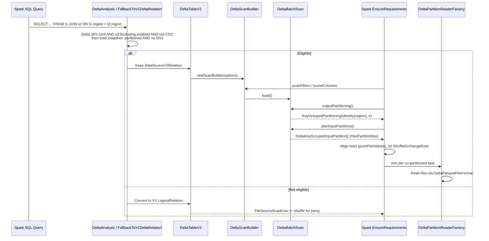

# Delta Lake Storage-Partitioned Join (SPJ): Design & Implementation Notes

**Spark target:** Apache Spark 4.x DataSource V2 Storage-Partitioned Join
([SPARK-37375](https://issues.apache.org/jira/browse/SPARK-37375))
**Status:** Opt-in, disabled by default (`spark.databricks.delta.storagePartitionedJoin.enabled`)

---

## Table of Contents

1. [Summary](#1-summary)
2. [Background: How Spark Storage-Partitioned Join Works](#2-background-how-spark-storage-partitioned-join-works)
3. [Why Delta Lake Could Not Use SPJ](#3-why-delta-lake-could-not-use-spj)
4. [Query Execution Flow](#4-query-execution-flow)
5. [Code Changes](#5-code-changes)
6. [Design Details & Invariants](#6-design-details--invariants)
7. [Limitations](#7-limitations)
8. [Test Suite](#8-test-suite)
9. [How to Enable & Test](#9-how-to-enable--test)

---

## 1. Summary

Take a join such as `SELECT * FROM orders o JOIN line_items l ON o.region = l.region`. Normally
Spark's `EnsureRequirements` rule adds a `ShuffleExchangeExec` on both sides of the join, which
redistributes all the data by `region` before the join runs.

Now suppose both Delta tables are `PARTITIONED BY (region)`. Every row with `region = 'US'` is
already stored only in files that belong to that partition, so the shuffle is wasted work.

Storage-Partitioned Join (SPJ) lets a DataSource V2 scan tell Spark how its data is laid out
(`KeyGroupedPartitioning`) and tag each input split with its partition key (`HasPartitionKey`).
Spark then pairs up matching splits from both sides and joins them in the same task, with no
shuffle. This applies to inner, outer, and semi joins, and also to aggregations grouped by the
partition columns.

This change adds an opt-in DataSource V2 read path for partitioned Delta tables that supports SPJ.

---

## 2. Background: How Spark Storage-Partitioned Join Works

For a scan to satisfy a join's or aggregation's `ClusteredDistribution` through SPJ, it must meet
these requirements:

1. **The physical scan must be `BatchScanExec` (DSv2).** The V1 `FileSourceScanExec` only supports
   Hive-style bucketing (`BucketSpec`). It does not take part in `KeyGroupedPartitioning`.
2. **The scan must implement `SupportsReportPartitioning`.** `outputPartitioning()` returns
   `KeyGroupedPartitioning(expressions, numPartitions)`. The expressions (for example
   `Expressions.identity("region")`) must refer to columns in the scan's `readSchema()`.
3. **Each `InputPartition` must implement `HasPartitionKey`.** `partitionKey()` returns an
   `InternalRow` whose fields match the `KeyGroupedPartitioning` expressions in number and type.

Spark's `BatchScanExec` then groups and sorts the input partitions by key. When the two sides have
different sets of partition values, `spark.sql.sources.v2.bucketing.pushPartValues.enabled=true`
adds empty partitions on the side that is missing a key. This keeps outer joins shuffle-free.

---

## 3. Why Delta Lake Could Not Use SPJ

1. **`DeltaTableV2` did not implement `SupportsRead`.** It had no `newScanBuilder`.
2. **Every read fell back to V1.** During analysis, `FallbackToV1DeltaRelation` (used by
   `DeltaAnalysis`) rewrote every `DataSourceV2Relation(DeltaTableV2)` into a V1
   `LogicalRelation(HadoopFsRelation)` backed by `TahoeLogFileIndex`. That always becomes a
   `FileSourceScanExec` in the physical plan.
3. **There was no V2 scan.** Nothing converted `AddFile.partitionValues` into typed partition keys
   grouped into `InputPartition`s.

---

## 4. Query Execution Flow


```mermaid
sequenceDiagram
    participant User as Spark SQL Query
    participant Analysis as DeltaAnalysis / FallbackToV1DeltaRelation
    participant TableV2 as DeltaTableV2
    participant ScanBuilder as DeltaScanBuilder
    participant BatchScan as DeltaBatchScan
    participant Planner as Spark EnsureRequirements
    participant Executor as DeltaPartitionReaderFactory

    User->>Analysis: SELECT ... FROM t1 JOIN t2 ON t1.region = t2.region
    Analysis->>Analysis: Delta SPJ conf AND v2.bucketing.enabled AND not CDC<br/>then load snapshot: partitioned AND no DVs
    alt Eligible
        Analysis->>TableV2: Keep DataSourceV2Relation
        TableV2->>ScanBuilder: newScanBuilder(options)
        Planner->>ScanBuilder: pushFilters / pruneColumns
        ScanBuilder->>BatchScan: build()
        Planner->>BatchScan: outputPartitioning()
        BatchScan-->>Planner: KeyGroupedPartitioning(identity(region), n)
        Planner->>BatchScan: planInputPartitions()
        BatchScan-->>Planner: DeltaKeyGroupedInputPartition[] (HasPartitionKey)
        Planner->>Planner: Align keys (pushPartValues), no ShuffleExchangeExec
        Planner->>Executor: Join per co-partitioned task
        Executor->>Executor: Read files via DeltaParquetFileFormat
    else Not eligible
        Analysis->>TableV2: Convert to V1 LogicalRelation
        TableV2-->>Planner: FileSourceScanExec (+ shuffle for joins)
    end
```

---

## 5. Code Changes

### 5.1 Configuration: `DeltaSQLConf.scala`

- `DeltaSQLConf.DELTA_STORAGE_PARTITIONED_JOIN_ENABLED`
- Key: `spark.databricks.delta.storagePartitionedJoin.enabled` (boolean, default `false`)
- It is off by default, so existing workloads keep their current V1 plans unless a user opts in.

### 5.2 Keeping the V2 relation: `FallbackToV1Relations.scala`

```scala
private def shouldKeepAsV2ForSPJ(d: DeltaTableV2, dsv2: DataSourceV2Relation): Boolean = {
  val conf = d.spark.sessionState.conf
  val enabled = conf.getConf(DeltaSQLConf.DELTA_STORAGE_PARTITIONED_JOIN_ENABLED) &&
    conf.getConf(SQLConf.V2_BUCKETING_ENABLED) &&
    !CDCReader.isCDCRead(dsv2.options)
  enabled && {
    val snapshot = d.initialSnapshot
    snapshot.metadata.partitionColumns.nonEmpty &&
      !DeletionVectorUtils.deletionVectorsReadable(snapshot)
  }
}
```

- The configuration checks run first, so the snapshot is not loaded when the feature is off.
- Without `spark.sql.sources.v2.bucketing.enabled`, the V2 scan gives no benefit, so the read
  stays on V1.
- Relations tagged with `KEEP_AS_V2_RELATION_TAG` (MERGE targets) keep their existing handling.
  DML commands convert their target to V1 through `DeltaRelation` as before.

### 5.3 `SupportsRead` on `DeltaTableV2`: `DeltaTableV2.scala`

- Adds `SupportsRead` to `DeltaTableV2`. `BATCH_READ` was already listed in `capabilities()`.
- `newScanBuilder(options)` returns `new DeltaScanBuilder(spark, this, tableSchema, options)`.

### 5.4 V2 scan: `v2/DeltaScanBuilder.scala`

| Class | Responsibility |
| :--- | :--- |
| `DeltaScanBuilder` | `SupportsPushDownRequiredColumns` (records the pruned `readSchema`) and `SupportsPushDownFilters`. All pushed filters are also returned as residuals, so Spark still evaluates them after the scan. |
| `DeltaBatchScan` | Prunes files, groups them by partition key, and reports `KeyGroupedPartitioning` (or `UnknownPartitioning` when SPJ doesn't apply). |
| `DeltaKeyGroupedInputPartition` | `InputPartition` with `HasPartitionKey`. Holds the files for one grouping key. |
| `DeltaScanFileInfo` | Absolute path, size, modification time, and the file's full partition-values row. |
| `DeltaPartitionReaderFactory` | Builds a row reader on the driver with `DeltaParquetFileFormat(protocol, metadata).buildReaderWithPartitionValues(...)`, using `deltaLog.newDeltaHadoopConf()`. |
| `DeltaBatchPartitionReader` | Reads the files of one partition one after another and closes each file's iterator before opening the next, and again on `close()`. |

**Planning input partitions in `DeltaBatchScan`:**

1. Convert the pushed `Filter`s to Catalyst expressions with `DeltaSourceUtils.translateFilters`,
   then resolve them against the table schema. Filters that can't be converted or resolved are
   skipped here; Spark still applies them after the scan.
2. Call `snapshot.filesForScan(filters)`, which does partition pruning and data skipping.
3. If SPJ applies, group the `AddFile`s by the values of the partition columns in `readSchema`
   (physical names). Each group becomes one `DeltaKeyGroupedInputPartition`. Otherwise each file
   becomes its own input partition.
4. Report the partitioning once (stored in a lazy val), as
   `KeyGroupedPartitioning(projectedPartitionColumns.map(Expressions.identity), numPartitions)`.

The scan doesn't sort the partitions itself. Spark's `BatchScanExec` groups and orders them by key.

---

## 6. Design Details & Invariants

### 6.1 Joining on a subset of the partition columns

Take a table partitioned by `(region, state)` and a query that joins only on `region` and doesn't
select `state`. With `spark.sql.sources.v2.bucketing.allowJoinKeysSubsetOfPartitionKeys.enabled=true`,
column pruning removes `state` from `readSchema`.

If the scan reported both `identity(region)` and `identity(state)`, Spark couldn't resolve `state`
against the scan output and would silently turn SPJ off. Following Iceberg's
`Partitioning.groupingKeyType`, `DeltaBatchScan` reports only the partition columns that appear in
`readSchema` (matched case-insensitively). It also groups files on those columns only, so
`(US, CA)` and `(US, NY)` end up in the same `InputPartition` with key `[US]`.

### 6.2 Two row widths: partition key vs. file partition values

- `BatchScanExec` needs `partitionKey().numFields` to equal the number of `KeyGroupedPartitioning`
  expressions, i.e. the number of *projected* partition columns.
- `ParquetFileFormat.buildReaderWithPartitionValues` needs each `PartitionedFile.partitionValues`
  to have one value per column in the *full* `metadata.partitionSchema`.

Both are met by storing two rows. `DeltaKeyGroupedInputPartition.partitionKey()` has the projected
columns, and each `DeltaScanFileInfo.partitionValues` has all partition columns.

### 6.3 Parsing partition values and column mapping

Partition values are parsed the same way as in `TahoeFileIndex.getPartitionValuesRow`:

- Values are looked up in `AddFile.partitionValues` by physical name
  (`DeltaColumnMapping.getPhysicalName`), so column mapping `name` and `id` modes work.
- Strings are converted with
  `Cast(Literal(value), dataType, Some(sessionLocalTimeZone), ansiEnabled = false)`, so Date,
  Timestamp, numeric and NULL partition values come out the same as in V1.

### 6.4 Fallback to V1 for Deletion Vectors and CDC

- **Deletion Vectors:** the V2 reader doesn't apply DV bitmaps yet. A table where
  `DeletionVectorUtils.deletionVectorsReadable(snapshot)` is true always uses the V1 scan, so
  deleted rows are never returned.
- **CDC reads** (`readChangeFeed`) always use the V1 path.

### 6.5 Time travel and DML

- Time travel (`VERSION AS OF` / `TIMESTAMP AS OF` and the `versionAsOf` read option) is resolved
  into `DeltaTableV2.initialSnapshot`, which the V2 scan reads from. Tests cover both forms.
- UPDATE, DELETE, MERGE and INSERT still convert their target to V1 through `DeltaRelation`.
  A partitioned Delta table used as a MERGE source or INSERT ... SELECT source may be read through
  the V2 scan.

---

## 7. Limitations

- **`_metadata` column:** `DeltaTableV2` doesn't implement `SupportsMetadataColumns`. With the
  feature on, queries that reference `_metadata` on an eligible table fail analysis.
- **No file splitting:** each Delta partition (grouping key) is read by a single task. Large
  partitions get less parallelism than with V1.
- **Row-based reads only:** `columnarSupportMode` is `UNSUPPORTED`, so there is no vectorized
  `ColumnarBatch` output yet.
- **Deletion Vectors and CDC:** these always use V1 (see 6.4).
- **Identity partitioning only:** only plain partition columns are reported. Generated columns are
  not turned into transform expressions.

---

## 8. Test Suite

`spark/src/test/scala/org/apache/spark/sql/delta/DeltaStoragePartitionedJoinSuite.scala` has 23
tests. They run with AQE and broadcast joins turned off so the plan checks are deterministic. Each
test checks the query result and the executed plan (`BatchScanExec` and non-range
`ShuffleExchangeExec` counts).

| # | Test | What it checks |
| :- | :--- | :--- |
| 1 | Delta Storage-Partitioned Join eliminates shuffle exchange on single partition key | String-partitioned join, no shuffle, all scans are `DeltaBatchScan`. |
| 2 | SPJ with multiple partition keys (composite partition) | Join on `(dept, yr)`, no shuffle. |
| 3 | SPJ with mismatched/disjoint partition values (pushPartValues) | Partitions `{p1, p2}` vs `{p2, p3}`, no shuffle. |
| 4 | SPJ with multiple files per partition | Multiple appends per partition; all files read, correct join result. |
| 5 | SPJ with typed partition columns: Date and Integer | Join on `(date_col, category)`, no shuffle. |
| 6 | SPJ with Timestamp partition column returns the same values as V1 | Timestamp partition values match the V1 read. |
| 7 | Partition column that is not the last column in the schema | `SELECT *`, projections, data filters, partition-only projection, `count(*)`. |
| 8 | Time travel reads the requested version | `VERSION AS OF` and the `versionAsOf` option. |
| 9 | DML on partitioned tables works with SPJ enabled | UPDATE, DELETE, MERGE and INSERT ... SELECT give correct results. |
| 10 | Incompatible partition columns fall back to shuffle | Tables partitioned on different columns still shuffle and return correct results. |
| 11 | One side unpartitioned falls back to shuffle | Partitioned joined with unpartitioned still shuffles. |
| 12 | Empty partitioned table in SPJ falls back to shuffle without error | Empty side, no error, empty result. |
| 13 | Fallback to V1 reader when SPJ is disabled | No `BatchScanExec` when the Delta conf is off. |
| 14 | Fallback to V1 reader when Spark V2 bucketing is disabled | No `BatchScanExec` when `v2.bucketing.enabled=false`. |
| 15 | E2E SPJ: Three-way partitioned join without shuffle exchanges | 3 `BatchScanExec`s, no join shuffle. |
| 16 | E2E SPJ: Aggregation with group by partition key avoids shuffle exchange | `GROUP BY dept` with no shuffle at all. |
| 17 | E2E SPJ: Subquery / Semi-Join on partition key avoids shuffle exchange | `IN (subquery)` semi-join, 2 scans, no join shuffle. |
| 18 | E2E SPJ: Left, Right, and Full Outer Joins without shuffle exchanges | Disjoint keys, correct NULL-padded rows, no shuffle. |
| 19 | E2E SPJ: Join keys subset of partition keys (allowJoinKeysSubsetOfPartitionKeys) | Partitioned by `(region, state)`, joined on `region`, no shuffle. |
| 20 | SPJ with WHERE partition filter pushdown prunes non-matching partitions | Each scan plans exactly 1 input partition. |
| 21 | Deletion Vector enabled table safely falls back to V1 and filters deleted rows | Deleted row is not returned; only the table without DVs uses `BatchScanExec`. |
| 22 | SPJ with Delta Column Mapping (name mode) | Physical-name lookup of partition values, no shuffle. |
| 23 | SPJ with tables containing NULL partition values | NULL keys grouped correctly, no shuffle. |

---

## 9. How to Enable & Test

### Spark configuration

```scala
spark.conf.set("spark.databricks.delta.storagePartitionedJoin.enabled", "true")
spark.conf.set("spark.sql.sources.v2.bucketing.enabled", "true")
spark.conf.set("spark.sql.sources.v2.bucketing.pushPartValues.enabled", "true")
// Optional: allow SPJ when joining on a subset of the table's partition columns
spark.conf.set("spark.sql.sources.v2.bucketing.allowJoinKeysSubsetOfPartitionKeys.enabled", "true")
```

### Running the test suite

```bash
build/sbt "spark/testOnly org.apache.spark.sql.delta.DeltaStoragePartitionedJoinSuite"
```
